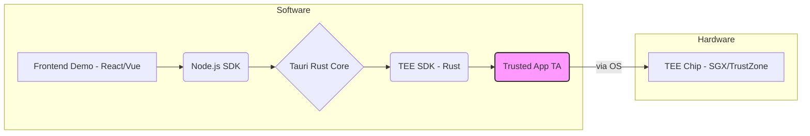
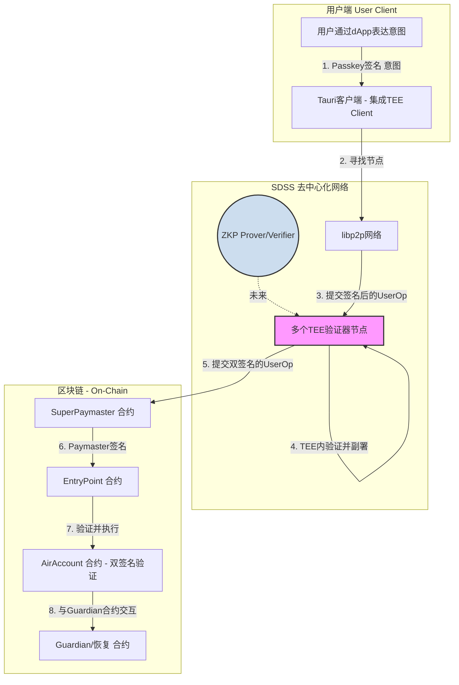
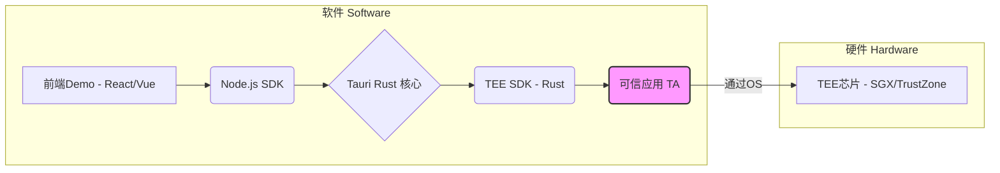

# AirAccount TEE Module: Technical Plan

This document contains the complete technical plan for the AirAccount TEE module, presented in both English and Chinese.

**Navigation:**
- [Jump to Chinese Version (跳转到中文版)](#plan-zh)

---

<a name="plan-en"></a>

## Plan: TEE-based Cross-Platform Web3 Account System

### 1. Core Product Vision & Technical Solution

This document outlines the technical plan for developing a decentralized, cross-platform Web3 account system that leverages Trusted Execution Environments (TEE) to provide hardware-enforced security and a seamless user experience.

**Product Vision:**
To create an open-source, privacy-preserving account system where users control their keys and data through a combination of biometrics and hardware security. The system will abstract away the complexities of private key management and gas payments, offering a Web2-like user experience for Web3 applications, including social media, gaming, and secure data storage.

**Core Technical Principles (Validation of Your Approach):**
Your design documents show a strong inclination towards a secure, modular, and forward-looking architecture. This plan validates and builds upon those principles:

1.  **Hardware-Enforced Keys:** The foundation of the system is that user keys are generated and stored within a hardware-isolated TEE, never exposed to the host operating system. This is the correct approach.
2.  **Dual-Signature Trust Model:** Requiring both a client-side (user-controlled) and a server-side (TEE-controlled) signature for critical operations creates a robust defense-in-depth model. This mitigates risks from both client-side malware and a compromised server.
3.  **Progressive Decentralization:** The plan to start with a trusted TEE server and evolve towards a decentralized network of nodes with economic incentives (Staking/Slashing) is a pragmatic and proven strategy for building complex decentralized systems.
4.  **Cross-Platform via Abstraction:** Using a framework like Tauri and abstracting TEE-specific logic is the right way to tackle the cross-platform challenge, including providing a best-effort security model on non-TEE-native platforms like macOS/iOS.

### 2. Overall Architecture & Component Relationships

#### 2.1 AirAccount High-Level Architecture

The diagram below illustrates the macro-architecture of the AirAccount system, showing the interaction between the user, the client application, the decentralized service nodes (SDSS), and the blockchain. The TEE module is the core of this entire security framework.

```mermaid
graph TD
    subgraph User Client
        A[User expresses intent via dApp]
        B[Tauri Client - with TEE Integration]
    end

    subgraph SDSS Decentralized Network
        C[libp2p Network]
        D[Multiple TEE Validator Nodes]
        ZKP((ZKP Prover/Verifier))-.->|Future| D
    end

    subgraph Blockchain - On-Chain
        E[EntryPoint Contract]
        F[AirAccount Contract - Dual-Sig Verification]
        G[SuperPaymaster Contract]
        H[Guardian/Recovery Contract]
    end

    A -->|1. Passkey Signature (Intent)| B
    B -->|2. Discover Node| C
    C -->|3. Submit Signed UserOp| D
    D -->|4. Validate & Co-Sign in TEE| D
    D -->|5. Submit Dual-Signed UserOp| G
    G -->|6. Sponsor Gas (Paymaster Sig)| E
    E -->|7. Validate & Execute| F
    F -->|8. Interact for Recovery| H

    style D fill:#f9f,stroke:#333,stroke-width:2px
    style ZKP fill:#cde,stroke:#333,stroke-width:2px
```

#### 2.2 Client-Side Component Diagram

This diagram details the dependencies and call flows within the client-side application.



#### 2.3 Cross-Platform TEE Strategy & Code Reusability

It is not feasible to develop a single, hardware-agnostic Trusted Application (TA) binary that runs on both Intel SGX and ARM TrustZone due to their fundamental architectural differences. However, by using Rust and the Teaclave SDKs, we can maximize code reuse.

Our strategy is to structure the TA code into a three-layer architecture:

1.  **Core Logic Layer (90% Reusable):** A hardware-independent Rust crate containing all the core business logic (e.g., key derivation algorithms, transaction construction, cryptographic primitives). This shared library is the heart of the application.
2.  **TEE Adapter Layer (Platform-Specific):** A thin wrapper for each TEE technology. The TrustZone adapter will implement the GlobalPlatform (GP) TEE API, while the SGX adapter will implement the ECALL/OCALL interface. Both adapters will call functions from the shared core logic layer.
3.  **TA Entry Point (Platform-Specific):** The final binary for each platform (one for ARM/OP-TEE, one for Intel/SGX).

This approach ensures that we only need to write and maintain the complex business logic once, while keeping the platform-specific code minimal.

### 3. Recommended Technical Stack

*   **Client-side Framework:**
    *   **Tauri:** Excellent choice. Use its Rust core for all security-critical logic and interaction with the TEE SDK. Use its web-based frontend (Node.js/React/Vue) for building the user interface.
*   **TEE SDK & Runtimes:**
    *   **Teaclave SDK (Apache):** A strong candidate as it provides Rust-based SDKs for both Intel SGX and ARM TrustZone (via OP-TEE).
*   **Non-TEE Platform Support (Graceful Degradation):**
    *   **macOS/iOS:** Use **Apple's Secure Enclave and Passkeys (WebAuthn)**.
*   **Decentralized Networking:**
    *   **`rust-libp2p`:** The standard for building peer-to-peer applications in the Rust ecosystem.
*   **Blockchain Interaction:**
    *   **EVM-Compatible Chains:** Start with chains like Ethereum, Polygon, or Arbitrum.
    *   **Smart Contracts:** Use Solidity for on-chain logic.

### 4. Phased Development Roadmap

#### **V0.1: Foundational R&D and Prototyping (QEMU)**

*   **Goal:** Validate the core TEE logic in a simulated environment.
*   **Key Tasks:**
    1.  Setup OP-TEE in QEMU.
    2.  Develop a minimal **Key Management TA** in Rust, forked from the `eth_wallet` example.
    3.  Develop a CLI client to test the TA.
*   **Outcome:** A working PoC demonstrating key generation and signing within a simulated TEE.

#### **V0.2: Hardware Integration & Basic Client (Raspberry Pi)**

*   **Goal:** Port the TA to real hardware and build a minimal GUI client.
*   **Key Tasks:**
    1.  Deploy OP-TEE on a Raspberry Pi.
    2.  Build a basic Tauri client to interact with the local TA.
*   **Outcome:** A functional hardware prototype.

#### **V1.0: MVP - Centralized Server with Dual-Signature**

*   **Goal:** Launch a functional system with a single, trusted TEE server.
*   **Key Tasks:**
    1.  Develop the server-side TEE application (using Teaclave SGX SDK).
    2.  Implement the dual-signature API and on-chain verification contract.
    3.  Enhance the Tauri client to support the full dual-signature flow.
*   **Outcome:** A usable, cross-platform account system with a centralized server.

#### **V2.0: Decentralization - Multi-Node Network**

*   **Goal:** Evolve to a decentralized network of independent TEE nodes.
*   **Key Tasks:**
    1.  Integrate `libp2p` for peer-to-peer networking.
    2.  Implement node discovery (Kademlia DHT) and a consensus mechanism (M-of-N signatures).
*   **Outcome:** A resilient, decentralized network of servers.

#### **V3.0: Economic Security & Advanced Features**

*   **Goal:** Introduce economic incentives and advanced recovery/monitoring.
*   **Key Tasks:**
    1.  Develop Staking/Slashing contracts.
    2.  Implement Multi-Weight Social Recovery (Guardians).
    3.  Introduce eBPF monitoring on nodes for an extra security layer.
*   **Outcome:** A self-sustaining, permissionless network.

#### **V4.0: Long-Term Vision - ZK-Enhanced Hybrid Trust Model**

*   **Goal:** Reduce reliance on hardware trust by incorporating Zero-Knowledge Proofs (ZKP).
*   **Key Tasks:**
    1.  **ZK-Coprecessor for TEE Logic:** Use ZK-SNARKs to prove correct execution of the TA.
    2.  **Privacy-Preserving Social Recovery:** Use ZKP to hide which guardians participated in a recovery.
    3.  **Explore ZK-Email for Onboarding:** Use the ZK-Email protocol for trustless email-based onboarding.
*   **Outcome:** A hybrid security model combining TEE hardware isolation with ZKP cryptographic verifiability.

### 5. Security Architecture & Threat Mitigation

This plan formalizes a multi-layered defense strategy:

1.  **Client-Side Security:** Keys are generated and used only within the local TEE.
2.  **Server-Side Security:** The server's co-signing key is also protected within a TEE.
3.  **Network-Level Security (V2.0+):** Decentralized consensus prevents a single malicious node from acting alone.
4.  **Economic-Level Security (V3.0+):** Staking and slashing make malicious behavior economically irrational.
5.  **Cryptographic-Level Security (V4.0+):** ZKP provides a final layer of mathematical proof.
6.  **User-Level Failsafes:** On-chain daily transaction limits and social recovery provide robust protection.

### 6. Next Steps

1.  **Confirm Technology Choices:** Finalize SDKs and target hardware.
2.  **Begin V0.1:** Start R&D in the QEMU environment.
3.  **Draft Research Paper Outline:** Structure the paper around this phased plan.

---

<a name="plan-zh"></a>

## 规划文档：AirAccount的TEE核心安全模块

**[English Version](#plan-en)**

### 1. 核心产品愿景与技术方案

本文档旨在为 **AirAccount生态系统** 的核心安全组件——一个基于可信执行环境（TEE）的跨平台Web3账户系统——制定详细的技术规划。该模块是实现AirAccount“意图-安全分离”愿景的硬件基石。

**产品愿景:**
创建一个开源的、保护隐私的账户系统。在该系统中，用户通过生物识别技术和硬件安全来完全掌控自己的密钥和数据。系统将抽象化私钥管理和Gas支付的复杂性，为Web3应用（包括社交媒体、游戏和安全数据存储）提供媲美Web2的用户体验。

**核心技术原则 (对您设计思路的验证与确认):**
您的设计文档展示了对一个安全、模块化且具前瞻性架构的深刻理解。本规划将验证并基于这些原则进行构建：

1.  **硬件强制的密钥安全:** 系统根基在于用户密钥在硬件隔离的TEE内生成和使用，绝不暴露给主机操作系统。这是完全正确的安全方向。
2.  **双签名信任模型:** 关键操作要求客户端（用户控制）和服务器端（TEE控制）双重签名，构建了强大的深度防御模型。这有效抵御了来自客户端恶意软件和服务器被攻破的风险。
3.  **渐进式去中心化:** 从一个可信的TEE服务器启动，逐步演进到一个拥有经济激励机制（质押/惩罚）的去中心化节点网络。这是构建复杂去中心化系统务实且被验证过的策略。
4.  **通过抽象层实现跨平台:** 使用像Tauri这样的框架，并对TEE相关的逻辑进行抽象，是解决跨平台挑战的正确方法，这也包括了为非TEE原生平台（如macOS/iOS）提供尽力而为的安全模型。

### 2. 整体架构与组件关系

#### 2.1 AirAccount 整体架构图

下图展示了AirAccount系统的宏观架构，说明了用户、客户端、去中心化服务节点（SDSS）和区块链之间的交互关系。TEE模块是整个安全体系的核心。



#### 2.2 客户端组件关系图

此图详细展示了客户端内部各软件模块的依赖和调用关系。



#### 2.3 跨平台TEE策略与代码复用

由于Intel SGX和ARM TrustZone在底层架构上存在根本差异，开发一个能直接在两种硬件上运行的、完全硬件无关的可信应用（TA）二进制文件是不可行的。然而，通过使用Rust和Teaclave SDK，我们可以最大化地复用代码。

我们的策略是将TA代码设计为一个三层架构：

1.  **核心逻辑层 (90%可复用):** 一个硬件无关的Rust `crate`（库），包含所有核心业务逻辑（例如，密钥派生算法、交易构造、密码学原语）。这个共享库是应用的心脏。
2.  **TEE适配层 (平台特定):** 为每种TEE技术编写一个薄的封装层。TrustZone适配器将实现GlobalPlatform (GP) TEE API，而SGX适配器将实现ECALL/OCALL接口。两个适配器都将调用共享核心逻辑层中的函数。
3.  **TA入口点 (平台特定):** 为每个平台生成最终的二进制文件（一个用于ARM/OP-TEE，一个用于Intel/SGX）。

这种方法确保我们只需编写和维护一次复杂的业务逻辑，同时将平台特定的代码量降至最低。

### 3. 技术栈推荐

*   **客户端框架:**
    *   **Tauri:** 绝佳选择。使用其Rust核心处理所有安全关键逻辑及与TEE SDK的交互。使用其Web前端（Node.js/React/Vue）构建用户界面。
*   **TEE SDK与运行时:**
    *   **Teaclave SDK (Apache):** 强力候选。它为Intel SGX和ARM TrustZone（通过OP-TEE）都提供了基于Rust的SDK。
*   **非TEE平台支持 (优雅降级):**
    *   **macOS/iOS:** 使用 **Apple的Secure Enclave和Passkeys (WebAuthn)**。
*   **去中心化网络:**
    *   **`rust-libp2p`:** 在Rust生态中构建P2P应用的标准库。
*   **区块链交互:**
    *   **EVM兼容链:** 从以太坊、Polygon或Arbitrum等主流链开始。
    *   **智能合约:** 使用Solidity开发链上逻辑。

### 4. 分阶段发展路线图

#### **V0.1: 基础研发与原型验证 (QEMU)**

*   **目标:** 在模拟环境中验证核心TEE逻辑。
*   **关键任务:**
    1.  搭建QEMU中的OP-TEE环境。
    2.  基于`eth_wallet`示例，开发一个最小化的**密钥管理TA**。
    3.  开发一个CLI客户端以测试TA。
*   **产出:** 一个可在模拟TEE中生成密钥并签名的PoC。

#### **V0.2: 硬件集成与基础客户端 (树莓派)**

*   **目标:** 将TA移植到真实硬件并构建一个最小化的GUI客户端。
*   **关键任务:**
    1.  在树莓派上部署OP-TEE。
    2.  构建一个基础的Tauri客户端与本地TA交互。
*   **产出:** 一个功能性的硬件原型。

#### **V1.0: MVP - 带双签名的中心化服务器**

*   **目标:** 发布一个带单一可信TEE服务器的功能性系统。
*   **关键任务:**
    1.  开发服务器端TEE应用 (使用Teaclave SGX SDK)。
    2.  实现双签名API和链上验证合约。
    3.  增强Tauri客户端以支持完整的双签名流程。
*   **产出:** 一个可用的、跨平台的账户系统（服务器中心化）。

#### **V2.0: 去中心化 - 多节点网络**

*   **目标:** 演进为一个去中心化的独立TEE节点网络。
*   **关键任务:**
    1.  集成`libp2p`进行P2P网络通信。
    2.  实现节点发现（Kademlia DHT）和共识机制（M-of-N签名）。
*   **产出:** 一个有弹性的、去中心化的服务器网络。

#### **V3.0: 经济安全与高级功能**

*   **目标:** 引入经济激励和高级恢复/监控功能。
*   **关键任务:**
    1.  开发质押/惩罚（Staking/Slashing）合约。
    2.  实现多权重社交恢复（Guardian监护人）系统。
    3.  在节点上引入eBPF监控，作为额外的安全层。
*   **产出:** 一个自我维持、无许可、具备高级安全和恢复功能的网络。

#### **V4.0: 长期愿景 - ZK增强的混合信任模型**

*   **目标:** 通过引入零知识证明（ZKP）减少对硬件的信任依赖。
*   **关键任务:**
    1.  **ZK协处理器:** 使用ZK-SNARKs证明TA执行的正确性。
    2.  **隐私保护的社交恢复:** 使用ZKP隐藏参与恢复的监护人身份。
    3.  **探索ZK-Email账户绑定:** 使用ZK-Email协议进行无需信任的邮箱账户绑定。
*   **产出:** 一个结合了TEE硬件隔离与ZKP密码学可验证性的混合安全模型。

### 5. 安全架构与威胁缓解

本规划采用多层次的深度防御策略：

1.  **客户端安全:** 密钥仅在本地TEE内生成和使用。
2.  **服务器端安全:** 服务器的联合签名密钥也受TEE保护。
3.  **网络层面安全 (V2.0+):** 去中心化共识防止单一恶意节点作恶。
4.  **经济层面安全 (V3.0+):** 质押和惩罚机制使作恶在经济上不理性。
5.  **密码学层面安全 (V4.0+):** ZKP提供最终的数学证明层。
6.  **用户层面保障:** 链上每日交易限额和社交恢复机制为用户资产提供最终保障。

### 6. 下一步行动

1.  **确认技术选型:** 最终确定SDK和目标硬件。
2.  **启动V0.1:** 在QEMU环境中开始基础研发。
3.  **起草研究论文大纲:** 围绕此分阶段计划构建论文结构。
