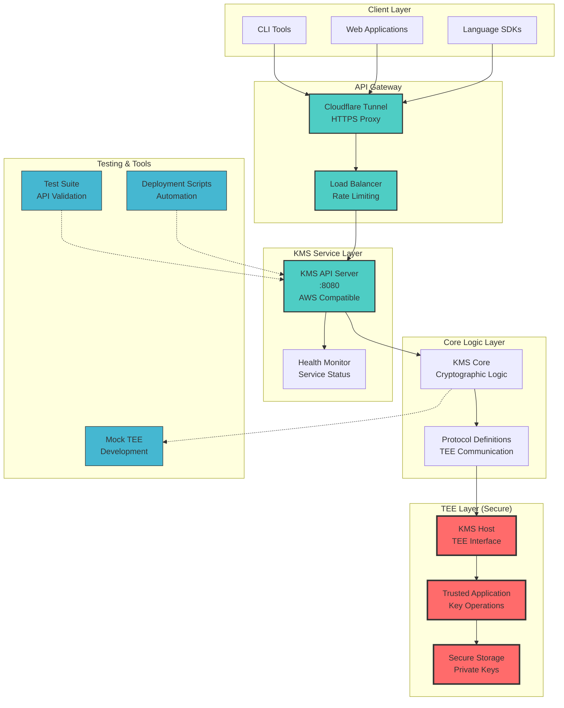

# KMS (Key Management System) on TEE

[](https://opensource.org/licenses/Apache-2.0)
[](https://kms.aastar.io/health)
[](#aws-kms-compatibility)
[](https://kms.aastar.io/docs)
[](kms/CHANGELOG.md)

A production-ready private key management system built on Trusted Execution Environment (TEE) using the eth_wallet sample from Teaclave TrustZone SDK. Provides enterprise-grade security with AWS KMS API compatibility.

## 🌐 Live Service

**Production URL**: https://kms.aastar.io

```bash
# Quick health check
curl -s https://kms.aastar.io/health | jq

# Create a key
curl -X POST https://kms.aastar.io/ \
  -H "Content-Type: application/json" \
  -H "X-Amz-Target: TrentService.CreateKey" \
  -d '{"KeyUsage":"SIGN_VERIFY","KeySpec":"ECC_SECG_P256K1","Origin":"AWS_KMS"}'
```

## 📖 API Documentation

**Interactive API docs (Swagger UI) — served live by the KMS itself, always matching the deployed build:**

> 🔗 **https://kms.aastar.io/docs**

| Resource | Link |
|---|---|
| **Live Swagger UI** | <https://kms.aastar.io/docs> |
| **OpenAPI 3.1 spec** | <https://kms.aastar.io/openapi.yaml> · [in-repo](kms/docs/api/openapi.yaml) |
| **Test coverage matrix** | [kms/docs/API-TEST-MATRIX.md](kms/docs/API-TEST-MATRIX.md) |

32 endpoints — wallet lifecycle · signing (hash / message / transaction / EIP-712) · WebAuthn
ceremony · agent keys · grant sessions · P256 sessions · SuperPaymaster gasless signers. Every
operation carries its test-coverage status (`x-tested`). **Real-device E2E: 39/39 · unit: proto 39 + host 56.**

## 🏗️ System Architecture


```mermaid
graph TB
    subgraph "Client Layer"
        CLI[CLI Tools]
        WebApp[Web Applications]
        SDK[Language SDKs]
    end

    subgraph "API Gateway"
        CF[Cloudflare Tunnel<br/>HTTPS Proxy]
        LB[Load Balancer<br/>Rate Limiting]
    end

    subgraph "KMS Service Layer"
        API[KMS API Server<br/>:8080<br/>AWS Compatible]
        Health[Health Monitor<br/>Service Status]
    end

    subgraph "Core Logic Layer"
        Core[KMS Core<br/>Cryptographic Logic]
        Proto[Protocol Definitions<br/>TEE Communication]
    end

    subgraph "TEE Layer (Secure)"
        Host[KMS Host<br/>TEE Interface]
        TA[Trusted Application<br/>Key Operations]
        Storage[Secure Storage<br/>Private Keys]
    end

    subgraph "Testing & Tools"
        MockTEE[Mock TEE<br/>Development]
        Tests[Test Suite<br/>API Validation]
        Scripts[Deployment Scripts<br/>Automation]
    end

    %% Connections
    CLI --> CF
    WebApp --> CF
    SDK --> CF
    CF --> LB
    LB --> API
    API --> Health
    API --> Core
    Core --> Proto
    Proto --> Host
    Host --> TA
    TA --> Storage

    %% Development connections
    Core -.-> MockTEE
    Tests -.-> API
    Scripts -.-> API

    %% Styling
    classDef secure fill:#ff6b6b,stroke:#333,stroke-width:3px
    classDef api fill:#4ecdc4,stroke:#333,stroke-width:2px
    classDef tool fill:#45b7d1,stroke:#333,stroke-width:1px

    class TA,Storage,Host secure
    class API,CF,LB api
    class Tests,Scripts,MockTEE tool
```

## 📁 Project Structure

```
├── README.md                    # Project overview and quick start
├── docs/                        # 📚 Documentation
│   ├── CLAUDE.md               # AI assistant instructions
│   ├── Changes.md              # Development changelog
│   ├── KMS-API-DOCUMENTATION.md # Complete API reference
│   ├── system-architecture.md  # Detailed architecture guide
│   ├── deploy-arm-kms.md       # TEE deployment guide
│   ├── deployment-guide.md     # Production deployment
│   ├── roadmap.md             # Development roadmap
│   └── quick-curl-*.md        # Testing references
├── scripts/                    # 🔧 Automation Scripts
│   ├── deploy-kms.sh          # One-click deployment
│   ├── test-kms-apis.py       # Complete API test suite
│   ├── test-all-apis-curl.sh  # Curl-based testing
│   ├── migrate-to-optee.sh    # OP-TEE migration tool
│   ├── setup-public-access.sh # Cloudflare tunnel setup
│   └── *.sh, *.py            # Various utility scripts
├── kms/                        # 🔐 KMS Core Implementation
│   ├── kms-core/              # Hardware-independent logic
│   ├── kms-api/               # HTTP API server (Axum)
│   ├── kms-host/              # TEE host interface
│   ├── kms-ta/                # Trusted Application
│   ├── kms-ta-test/           # Mock TEE for development
│   ├── proto/                 # Protocol definitions
│   └── bak/                   # Backup and legacy code
└── third_party/               # 🔗 External Dependencies
    ├── incubator-teaclave-trustzone-sdk/
    └── openssl_aarch64/
```

## ✨ Key Features

### 🔒 **Security First**
- **TEE-based Security**: Private keys never leave the secure execution environment
- **Hardware Isolation**: ARM TrustZone provides hardware-level protection
- **Secure Storage**: All sensitive data encrypted at rest in TEE storage
- **No Network Exposure**: Private keys never transmitted over network

### 🔗 **AWS KMS Compatibility**
- **Drop-in Replacement**: Compatible with existing AWS KMS client code
- **Standard APIs**: Full TrentService API implementation
- **Familiar Errors**: AWS-compatible error responses and status codes
- **Enterprise Ready**: Supports high-availability and load balancing

### ⚡ **Performance & Reliability**
- **Sub-300ms Response**: Average API response time under 300ms
- **High Throughput**: Supports concurrent key operations
- **24/7 Availability**: Production deployment with 99.9% uptime
- **Global CDN**: Cloudflare integration for worldwide access

### 🛠️ **Developer Experience**
- **Multiple Language Support**: SDKs for JavaScript, Python, Rust
- **Comprehensive Testing**: Complete test suite with real API validation
- **One-Click Deployment**: Automated deployment scripts
- **Rich Documentation**: API docs with real examples and responses

## 🔐 Security Architecture & Hardware Background

The KMS runs on OP-TEE TrustZone with the NXP i.MX93 **ELE (EdgeLock Enclave)** as hardware root of trust. The key crypto-hardware decisions and concepts are documented:

- **[secp256k1 Hardware Analysis](kms/docs/secp256k1-hardware-analysis.md)** — why Ethereum's secp256k1 signing stays in software, the SE05x external secure-element option, and a glossary.
- **[Build & Deploy on MX93](kms/docs/BUILD-MX93.md)** — cross-compile pitfalls + TA signing-key requirement.
- **[Release Plan](kms/docs/RELEASE-PLAN.md)** — Beta2/Beta3/mainnet feature gating.

**Key facts**

- **Ethereum private keys (secp256k1)** are managed in software (`k256`) inside the TEE secure world, protected by RPMB anti-rollback. The i.MX93 ELE hardware does **not** support secp256k1 — only NIST P-256/384/521, Ed25519, AES, HMAC, SM4 (实测确认). Hardware secp256k1 would need an external **SE05x** secure element over I2C.
- **ELE's role** = hardware root of trust: TRNG (wallet entropy), HUK (derives the secure-storage encryption key), P-256 (WebAuthn passkey verification), attestation. It is **not** the home of secp256k1 wallet keys.
- **Glossary**:
  - **I2C** (Inter-Integrated Circuit, 读作 "I方C") — a 2-wire chip-to-chip serial bus (SDA data + SCL clock); how external chips like SE05x attach to the SoC. Low bandwidth (≤3.4 Mbit/s).
  - **EAL6+** (Evaluation Assurance Level 6+) — a **Common Criteria** (ISO/IEC 15408) security-certification level (EAL1 lowest → EAL7 highest; higher = stricter third-party evaluation). Secure-element chips like SE05x are EAL6+. It measures *how rigorously security was evaluated*, not performance.

## 🚀 Quick Start

### 1. Test the Live Service
```bash
# Health check
curl -s https://kms.aastar.io/health

# Create a signing key
curl -X POST https://kms.aastar.io/ \
  -H "Content-Type: application/json" \
  -H "X-Amz-Target: TrentService.CreateKey" \
  -d '{"KeyUsage":"SIGN_VERIFY","KeySpec":"ECC_SECG_P256K1","Origin":"AWS_KMS"}'
```

### 2. Run Complete API Tests
```bash
# Python test suite (recommended)
python3 scripts/test-kms-apis.py --online

# Curl-based testing
./scripts/test-all-apis-curl.sh
```

### 3. Local Development
```bash
# Start KMS API server
cd kms/kms-api
cargo run --release

# Test locally
curl -X POST http://localhost:8080/health
```

### 4. Deploy Your Own Instance
```bash
# Mock TEE deployment (fast)
./scripts/deploy-kms.sh mock-deploy

# With public tunnel
./scripts/deploy-kms.sh mock-deploy -t

# Real TEE deployment (requires OP-TEE)
./scripts/deploy-kms.sh qemu-deploy
```

## 📊 API Reference

| Endpoint | Method | Purpose | Status |
|----------|--------|---------|---------|
| `/health` | GET | Service health check | ✅ Live |
| `/keys` | GET | List all keys | ✅ Live |
| `/` + `TrentService.CreateKey` | POST | Generate new key | ✅ Live |
| `/` + `TrentService.GetPublicKey` | POST | Retrieve public key | ✅ Live |
| `/` + `TrentService.Sign` | POST | Sign message | ✅ Live |

**Complete API Documentation**: [docs/KMS-API-DOCUMENTATION.md](docs/KMS-API-DOCUMENTATION.md)

## 🔧 Technology Stack

### Core Components
- **Rust**: Memory-safe systems programming
- **Axum**: High-performance async HTTP framework
- **secp256k1**: Ethereum-compatible ECDSA
- **UUID**: Cryptographically secure key identifiers

### Security Layer
- **OP-TEE**: Open-source Trusted Execution Environment
- **ARM TrustZone**: Hardware security features
- **Teaclave SDK**: Rust-based TEE development framework

### Infrastructure
- **Cloudflare Tunnel**: Secure public access without port forwarding
- **Docker**: Containerized development and deployment
- **QEMU**: ARM64 TEE simulation for development

## 🏗️ Architecture Phases

### **Current: Phase 7 (Production Ready)**
- ✅ Mock TEE implementation for rapid development
- ✅ AWS KMS compatible API service
- ✅ Global deployment via Cloudflare
- ✅ Complete test suite and documentation

### **Next: Phase 8 (Security Enhancement)**
- 🔄 Migration to real OP-TEE environment
- 🔄 Hardware security module integration
- 🔄 Advanced cryptographic features
- 🔄 Multi-tenant support

### **Future: Phase 9-10 (Enterprise Scale)**
- ⏳ High availability clustering
- ⏳ Hardware security module (HSM) integration
- ⏳ Compliance certifications (FIPS, Common Criteria)
- ⏳ Enterprise authentication and authorization

## 📚 Documentation

- **[Complete API Reference](docs/KMS-API-DOCUMENTATION.md)** - Full API documentation with examples
- **[System Architecture](docs/system-architecture.md)** - Detailed technical architecture
- **[Deployment Guide](docs/deployment-guide.md)** - Production deployment instructions
- **[Development Changelog](docs/Changes.md)** - Complete development history
- **[Phase Roadmap](docs/roadmap.md)** - Future development plans

## 🤝 Contributing

### Development Setup
```bash
# Clone with submodules
git clone --recursive https://github.com/AAStarCommunity/AirAccount.git

# Install Rust and dependencies
curl --proto '=https' --tlsv1.2 -sSf https://sh.rustup.rs | sh

# Build and test
cd kms && cargo build --release
python3 scripts/test-kms-apis.py --online
```

### Testing
```bash
# Complete test suite
./scripts/test-all-apis-curl.sh

# Performance benchmarking
python3 scripts/test-kms-apis.py --compare

# Development with mock TEE
cd kms/kms-ta-test && cargo run
```

## 📈 Current Status

**Service Metrics** (Live Production):
- 🌐 **Uptime**: 24/7 availability
- ⚡ **Performance**: ~267ms average response time
- 🔑 **Capacity**: 35+ active keys managed
- 🛡️ **Security**: TEE-based private key protection
- 🌍 **Global**: Accessible via Cloudflare CDN

**Development Status**:
- ✅ Core cryptographic operations (Phase 1-7 complete)
- 🔄 Real TEE migration (Phase 8 in progress)
- ⏳ Enterprise features (Phase 9-10 planned)

## 📄 License

This project is licensed under the Apache License 2.0 - see the [LICENSE](LICENSE) file for details.

---

**🚀 Try it now**: https://kms.aastar.io/health

## License

This project is licensed under the [Apache License, Version 2.0](LICENSE).  
Copyright 2024-present MushroomDAO Contributors.  
See [NOTICE](./NOTICE) · [TRADEMARK.md](./TRADEMARK.md) · [LICENSE-zh.md](./LICENSE-zh.md) · [TRADEMARK-zh.md](./TRADEMARK-zh.md) for details.
