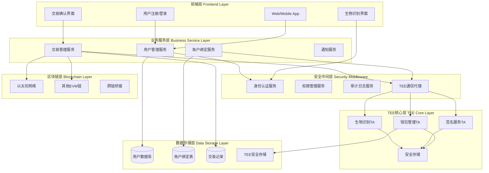
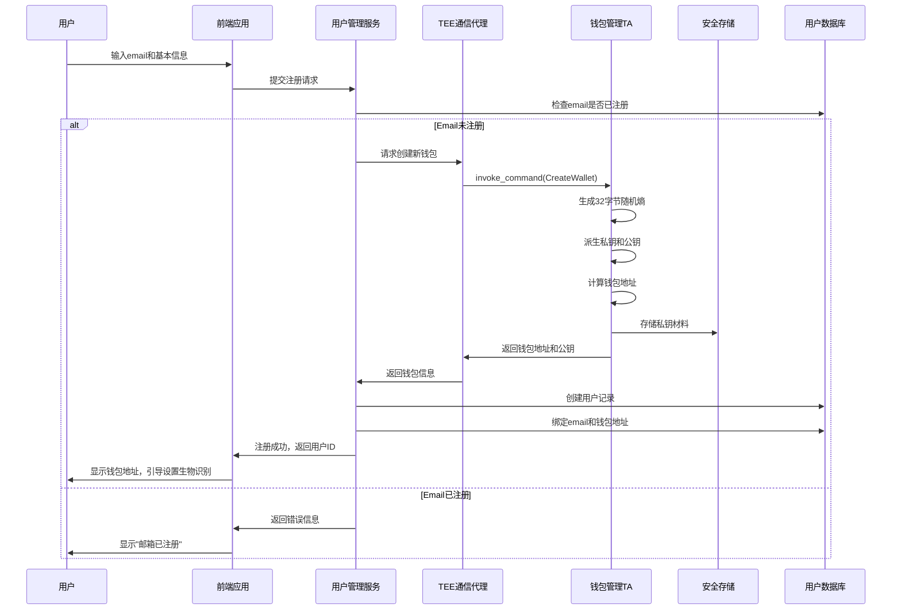
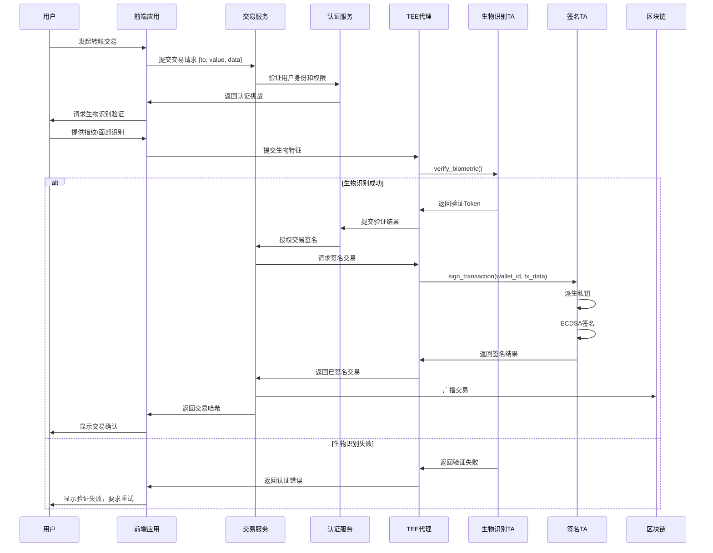

# AirAccount 业务架构设计文档

## 1. 业务模型概述

AirAccount是一个基于TEE的Web3账户系统，采用Web2+Web3混合架构，为用户提供安全便捷的区块链账户服务。核心理念是通过传统的Web2用户体验（email注册）来管理底层的Web3资产（私钥和钱包地址）。

### 1.1 核心业务假设

1. **用户注册模式**: 用户使用email等Web2身份信息注册
2. **账户绑定机制**: 每个Web2账户绑定一个或多个TEE生成的钱包地址  
3. **私钥生命周期**: TEE负责私钥的生成、存储、签名，永不暴露
4. **用户体验**: 用户无需了解私钥概念，通过生物识别等方式授权交易

## 2. 整体系统架构



## 3. 账户生命周期管理

### 3.1 用户注册流程



### 3.2 账户绑定数据模型

```sql
-- 用户基础信息表
CREATE TABLE users (
    user_id BIGSERIAL PRIMARY KEY,
    email VARCHAR(255) UNIQUE NOT NULL,
    username VARCHAR(100),
    avatar_url VARCHAR(500),
    phone_number VARCHAR(20),
    created_at TIMESTAMP DEFAULT NOW(),
    updated_at TIMESTAMP DEFAULT NOW(),
    status ENUM('active', 'suspended', 'deleted') DEFAULT 'active'
);

-- 钱包绑定表
CREATE TABLE wallet_bindings (
    binding_id BIGSERIAL PRIMARY KEY,
    user_id BIGINT REFERENCES users(user_id),
    wallet_id UUID NOT NULL,           -- TEE中的钱包UUID
    wallet_address VARCHAR(42) NOT NULL, -- 0x开头的以太坊地址
    chain_id INT NOT NULL,             -- 链ID (1=Ethereum, 137=Polygon, etc.)
    derivation_path VARCHAR(100),      -- HD钱包派生路径
    alias VARCHAR(100),                -- 用户设置的钱包别名
    is_primary BOOLEAN DEFAULT false,  -- 是否为主钱包
    created_at TIMESTAMP DEFAULT NOW(),
    last_used_at TIMESTAMP,
    
    UNIQUE(wallet_address, chain_id),
    INDEX idx_user_wallets (user_id, is_primary)
);

-- 生物识别绑定表
CREATE TABLE biometric_profiles (
    profile_id BIGSERIAL PRIMARY KEY,
    user_id BIGINT REFERENCES users(user_id),
    biometric_type ENUM('fingerprint', 'face', 'voice') NOT NULL,
    template_hash VARCHAR(64),         -- 生物特征模板哈希
    tee_template_id UUID,              -- TEE中存储的模板ID
    device_id VARCHAR(100),            -- 注册设备ID
    is_active BOOLEAN DEFAULT true,
    created_at TIMESTAMP DEFAULT NOW(),
    last_verified_at TIMESTAMP,
    
    UNIQUE(user_id, biometric_type, device_id)
);
```

### 3.3 私钥生成和管理策略

#### 3.3.1 HD钱包架构

```rust
// 基于BIP44标准的多链HD钱包结构
// m / purpose' / coin_type' / account' / change / address_index

pub struct HDWalletManager {
    master_seed: SecureBytes,     // 主种子 (存储在TEE)
    user_id: u64,                 // 关联的用户ID
}

impl HDWalletManager {
    // 为用户生成主钱包 (account=0)
    pub fn create_primary_wallet(user_id: u64) -> Result<(WalletId, Address)> {
        // m/44'/60'/0'/0/0 (以太坊主网主地址)
    }
    
    // 为同一用户生成子钱包 (account递增)
    pub fn create_sub_wallet(user_id: u64, account_index: u32) -> Result<(WalletId, Address)> {
        // m/44'/60'/{account_index}'/0/0
    }
    
    // 支持多链地址派生
    pub fn derive_multi_chain_address(
        wallet_id: &WalletId, 
        chain_id: u32
    ) -> Result<Address> {
        // 根据chain_id确定coin_type
        let coin_type = match chain_id {
            1 => 60,      // 以太坊
            137 => 966,   // Polygon
            56 => 714,    // BSC
            // ...
        };
    }
}
```

#### 3.3.2 安全存储策略

```rust
pub struct SecureWalletStorage {
    // TEE安全存储中的数据结构
    pub user_wallets: HashMap<UserId, Vec<WalletEntry>>,
    pub master_seeds: HashMap<UserId, EncryptedSeed>,
    pub biometric_templates: HashMap<UserId, Vec<BiometricTemplate>>,
}

#[derive(Serialize, Deserialize)]
pub struct WalletEntry {
    wallet_id: Uuid,
    derivation_path: String,
    created_at: u64,
    last_used_at: Option<u64>,
    metadata: WalletMetadata,
}

#[derive(Serialize, Deserialize)] 
pub struct EncryptedSeed {
    encrypted_data: Vec<u8>,      // 使用KEK加密的主种子
    salt: [u8; 32],               // 密钥派生盐值
    nonce: [u8; 12],              // 加密随机数
    auth_tag: [u8; 16],           // GCM认证标签
}
```

## 4. 交易签名流程

### 4.1 完整的交易授权流程



### 4.2 安全考虑要点

#### 4.2.1 多层安全验证

```rust
pub struct TransactionAuthorization {
    // 第一层：Web2身份验证
    pub user_session: AuthenticatedSession,
    
    // 第二层：生物识别验证
    pub biometric_proof: BiometricProof,
    
    // 第三层：交易内容确认
    pub tx_confirmation: TransactionConfirmation,
    
    // 第四层：频率和金额限制
    pub risk_assessment: RiskAssessment,
}

impl TransactionAuthorization {
    pub fn validate_full_authorization(&self) -> Result<()> {
        // 1. 检查会话有效性
        self.user_session.verify_validity()?;
        
        // 2. 验证生物特征
        self.biometric_proof.verify_in_tee()?;
        
        // 3. 确认交易详情
        self.tx_confirmation.verify_user_intent()?;
        
        // 4. 风险评估检查
        self.risk_assessment.check_limits()?;
        
        Ok(())
    }
}
```

#### 4.2.2 防重放和nonce管理

```rust
pub struct NonceManager {
    // 每个钱包的nonce状态
    wallet_nonces: HashMap<WalletId, u64>,
    // 待处理交易的nonce预留
    pending_nonces: HashMap<WalletId, Vec<u64>>,
}

impl NonceManager {
    pub fn allocate_nonce(&mut self, wallet_id: &WalletId) -> Result<u64> {
        let current_nonce = self.get_current_nonce(wallet_id)?;
        let next_nonce = current_nonce + 1;
        
        // 检查是否存在nonce gap
        if self.has_pending_lower_nonce(wallet_id, next_nonce) {
            return Err("Nonce gap detected".into());
        }
        
        self.pending_nonces
            .entry(*wallet_id)
            .or_default()
            .push(next_nonce);
            
        Ok(next_nonce)
    }
}
```

## 5. 扩展功能设计

### 5.1 多重签名钱包支持

```rust
pub struct MultiSigWalletConfig {
    threshold: u8,                    // 签名阈值
    owners: Vec<UserId>,             // 所有者用户ID列表
    wallet_address: Address,         // 多签合约地址
    daily_limit: Option<U256>,       // 日限额（小额交易可单签）
}

pub struct MultiSigTransaction {
    tx_hash: H256,
    to: Address,
    value: U256,
    data: Vec<u8>,
    signatures: Vec<(UserId, Signature)>,  // 已收集的签名
    required_confirmations: u8,
    current_confirmations: u8,
    created_at: u64,
    expires_at: u64,
}
```

### 5.2 社交恢复机制

```rust
pub struct SocialRecoveryConfig {
    user_id: UserId,
    guardians: Vec<GuardianInfo>,    // 监护人信息
    recovery_threshold: u8,          // 恢复阈值
    recovery_delay: u64,             // 恢复延迟期（秒）
}

pub struct GuardianInfo {
    guardian_user_id: UserId,
    guardian_email: String,
    guardian_type: GuardianType,     // Family, Friend, Institution
    added_at: u64,
    last_active_at: Option<u64>,
}

pub enum RecoveryMethod {
    SocialRecovery {
        guardian_approvals: Vec<GuardianApproval>,
    },
    BackupPhrase {
        encrypted_phrase: EncryptedMnemonic,
    },
    HardwareDevice {
        device_signature: DeviceSignature,
    },
}
```

## 6. 数据流和接口设计

### 6.1 核心API接口

```rust
// 用户管理API
pub trait UserManagementAPI {
    async fn register_user(email: String, profile: UserProfile) -> Result<UserId>;
    async fn authenticate_user(credentials: Credentials) -> Result<AuthSession>;
    async fn setup_biometric(user_id: UserId, biometric_data: BiometricData) -> Result<()>;
}

// 钱包管理API  
pub trait WalletManagementAPI {
    async fn create_wallet(user_id: UserId) -> Result<WalletInfo>;
    async fn get_user_wallets(user_id: UserId) -> Result<Vec<WalletInfo>>;
    async fn derive_address(wallet_id: WalletId, chain_id: u32) -> Result<Address>;
}

// 交易签名API
pub trait TransactionAPI {
    async fn prepare_transaction(
        wallet_id: WalletId,
        transaction: TransactionRequest
    ) -> Result<PreparedTransaction>;
    
    async fn sign_transaction(
        wallet_id: WalletId,
        prepared_tx: PreparedTransaction,
        authorization: TransactionAuthorization
    ) -> Result<SignedTransaction>;
    
    async fn broadcast_transaction(
        signed_tx: SignedTransaction
    ) -> Result<TransactionHash>;
}
```

### 6.2 事件驱动架构

```rust
pub enum AirAccountEvent {
    // 用户生命周期事件
    UserRegistered { user_id: UserId, email: String },
    UserAuthenticated { user_id: UserId, method: AuthMethod },
    
    // 钱包生命周期事件
    WalletCreated { user_id: UserId, wallet_id: WalletId, address: Address },
    WalletUsed { wallet_id: WalletId, transaction_hash: H256 },
    
    // 安全事件
    BiometricSetup { user_id: UserId, biometric_type: BiometricType },
    SecurityViolation { user_id: UserId, violation_type: String, details: String },
    
    // 交易事件
    TransactionInitiated { user_id: UserId, tx_hash: H256, amount: U256 },
    TransactionSigned { wallet_id: WalletId, tx_hash: H256 },
    TransactionBroadcast { tx_hash: H256, chain_id: u32 },
}
```

## 7. 部署和运维考虑

### 7.1 系统配置

```yaml
# AirAccount系统配置
airaccount:
  database:
    host: "postgres.internal"
    database: "airaccount"
    max_connections: 100
    
  tee:
    optee_client_path: "/opt/optee/client"
    ta_uuid: "be2dc9a0-02b4-4b33-ba21-9964dbdf1573" 
    max_sessions: 50
    session_timeout: "30m"
    
  security:
    biometric_threshold: 0.95
    transaction_daily_limit: "10000.0" # USD
    session_duration: "24h"
    recovery_delay: "7d"
    
  blockchain:
    ethereum:
      rpc_url: "https://eth-mainnet.alchemyapi.io/v2/YOUR-API-KEY"
      chain_id: 1
    polygon:
      rpc_url: "https://polygon-rpc.com"  
      chain_id: 137
```

### 7.2 监控指标

```rust
pub struct AirAccountMetrics {
    // 用户指标
    pub active_users: Counter,
    pub new_registrations: Counter,
    pub authentication_success_rate: Histogram,
    
    // 钱包指标  
    pub wallets_created: Counter,
    pub wallet_creation_duration: Histogram,
    
    // 交易指标
    pub transactions_initiated: Counter,
    pub transactions_signed: Counter,
    pub signature_duration: Histogram,
    
    // 安全指标
    pub biometric_verification_success_rate: Histogram,
    pub security_violations: CounterVec, // by type
    pub tee_health_status: Gauge,
}
```

## 8. 总结

AirAccount的业务架构将Web2的用户体验与Web3的资产安全完美结合：

**核心价值**：
- 🔒 **安全性**：私钥永不离开TEE，多层验证保护
- 🚀 **易用性**：Email注册，生物识别授权，无需记忆私钥  
- 🔄 **可扩展**：支持多链、多签、社交恢复等高级功能
- 📊 **可运维**：完整的监控、审计和故障恢复机制

**技术优势**：
- 基于成熟的eth_wallet架构，降低开发风险
- 模块化设计，便于功能扩展和维护  
- 事件驱动架构，支持微服务部署
- 完整的安全边界划分和访问控制

这个架构为用户提供了安全便捷的Web3钱包服务，同时为开发团队提供了清晰的实现路径。

---

*文档版本: v1.0*  
*创建时间: 2025-01-08*  
*适用项目: AirAccount TEE钱包系统*