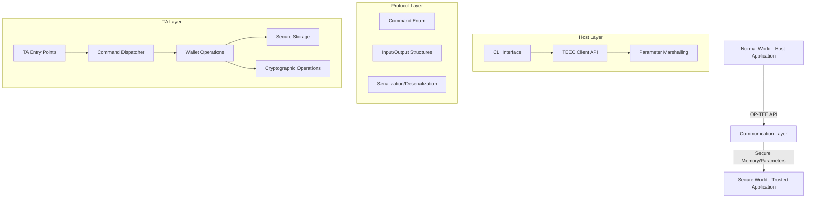
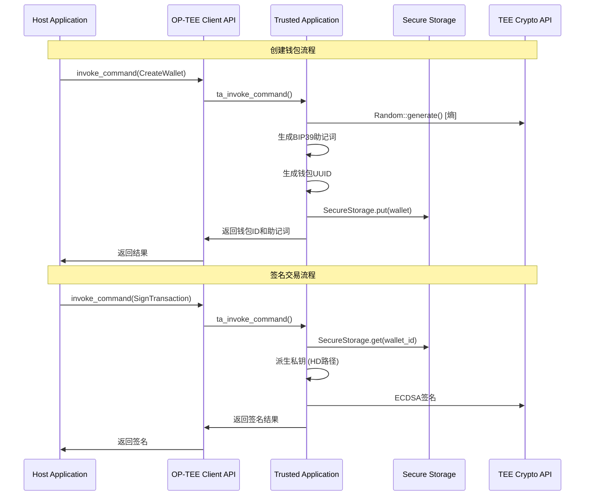
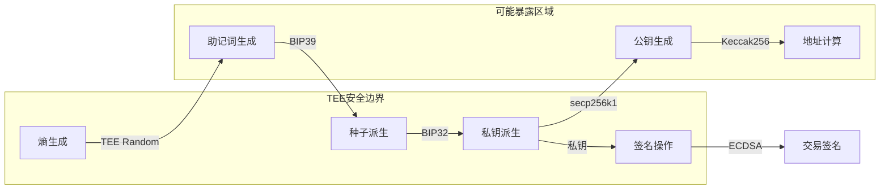

# Apache Teaclave TrustZone SDK中eth_wallet示例深度技术分析报告

## 1. 项目概览

eth_wallet是Apache Teaclave TrustZone SDK中的一个Web3钱包参考实现，展示了如何在Trusted Execution Environment (TEE)中安全地管理以太坊私钥和签名交易。该项目遵循TEE安全设计原则，确保私钥在整个生命周期中都不会离开安全环境。

**项目UUID:** `be2dc9a0-02b4-4b33-ba21-9964dbdf1573`

## 2. 代码结构分析

### 2.1 整体架构

```
eth_wallet/
├── proto/          # 协议定义层 (共享数据结构)
├── ta/             # Trusted Application (安全世界)  
├── host/           # Client Application (正常世界)
├── uuid.txt        # TA唯一标识符
└── Makefile        # 构建脚本
```

### 2.2 三层架构设计



## 3. 核心组件分析

### 3.1 Protocol Layer (proto/)

**核心数据结构:**

```rust
// 命令枚举
pub enum Command {
    CreateWallet,    // 创建钱包
    RemoveWallet,    // 删除钱包  
    DeriveAddress,   // 派生地址
    SignTransaction, // 签名交易
}

// 以太坊交易结构
pub struct EthTransaction {
    pub chain_id: u64,      // 链ID
    pub nonce: u128,        // 随机数
    pub to: Option<[u8; 20]>, // 目标地址
    pub value: u128,        // 转账金额
    pub gas_price: u128,    // Gas价格
    pub gas: u128,          // Gas限制
    pub data: Vec<u8>,      // 交易数据
}
```

**通信协议特点:**
- 使用`serde`进行序列化/反序列化
- 采用`bincode`作为二进制编码格式
- 支持UUID作为钱包标识符
- 结构化的输入/输出参数传递

### 3.2 Trusted Application (ta/)

#### 3.2.1 TA生命周期管理

```rust
#[ta_create]     // TA创建入口点
#[ta_open_session]  // 会话建立
#[ta_close_session] // 会话关闭
#[ta_destroy]    // TA销毁
#[ta_invoke_command] // 命令调用入口
```

#### 3.2.2 核心钱包实现 (wallet.rs)

**钱包结构:**
```rust
pub struct Wallet {
    id: Uuid,           // 钱包唯一ID
    entropy: Vec<u8>,   // 熵源(32字节)
}
```

**关键方法分析:**

1. **密钥生成 (`new()`)**
   - 使用TEE硬件随机数生成器生成32字节熵
   - 生成UUID作为钱包标识符
   - 确保熵的真随机性和不可预测性

2. **BIP39助记词生成 (`get_mnemonic()`)**
   - 基于熵生成符合BIP39标准的助记词
   - 使用英语词典
   - **安全风险:** 助记词返回到Normal World，生产环境需优化

3. **HD钱包密钥派生 (`derive_prv_key()`, `derive_pub_key()`)**
   - 支持BIP32 HD钱包标准
   - 默认路径: `m/44'/60'/0'/0/0` (以太坊标准)
   - 私钥始终在TEE内部处理，不会暴露

4. **地址派生 (`derive_address()`)**
   - secp256k1公钥生成
   - Keccak-256哈希计算
   - 以太坊地址格式 (取哈希的最后20字节)

5. **交易签名 (`sign_transaction()`)**
   - 支持Legacy Transaction格式
   - ECDSA签名算法
   - 符合以太坊签名标准

#### 3.2.3 安全存储集成

```rust
const DB_NAME: &str = "eth_wallet_db";
let db_client = SecureStorageClient::open(DB_NAME)?;
```

- 使用`secure_db`抽象层
- 密钥持久化存储在TEE安全存储
- 支持基于UUID的查询和删除操作

#### 3.2.4 内存安全机制

```rust
impl Drop for Wallet {
    fn drop(&mut self) {
        self.entropy.iter_mut().for_each(|x| *x = 0); // 清零敏感数据
    }
}
```

### 3.3 Host Application (host/)

#### 3.3.1 TEEC客户端实现

**通信流程:**
```rust
fn invoke_command(command: proto::Command, input: &[u8]) -> Result<Vec<u8>> {
    let mut ctx = Context::new()?;           // 创建TEE上下文
    let uuid = Uuid::parse_str(proto::UUID)?; // 解析TA UUID
    let mut session = ctx.open_session(uuid)?; // 打开TA会话
    
    // 参数设置
    let p0 = ParamTmpRef::new_input(input);    // 输入缓冲区
    let p1 = ParamTmpRef::new_output(output);  // 输出缓冲区  
    let p2 = ParamValue::new(0, 0, ParamType::ValueInout); // 长度参数
    
    session.invoke_command(command as u32, &mut operation)
}
```

#### 3.3.2 CLI接口设计

支持的命令:
- `create-wallet`: 创建新钱包
- `derive-address -w <wallet_id> -h <hd_path>`: 派生地址
- `sign-transaction -w <wallet_id> -t <to> -v <value>`: 签名交易  
- `remove-wallet -w <wallet_id>`: 删除钱包
- `test`: 运行完整工作流测试

## 4. 核心工作流程图



## 5. 关键API接口分析

### 5.1 TEE内部API

| API | 功能 | 安全特性 |
|-----|------|----------|
| `Random::generate()` | 硬件随机数生成 | 真随机数，不可预测 |
| `SecureStorageClient` | 安全存储访问 | 加密存储，TEE保护 |
| `bincode::serialize` | 数据序列化 | 高效二进制编码 |
| `secp256k1::sign` | 椭圆曲线签名 | 密码学安全签名 |

### 5.2 Host-TA通信API

| 参数类型 | 用途 | 大小限制 |
|----------|------|----------|
| `ParamTmpRef::Input` | 命令输入数据 | 可变长度 |
| `ParamTmpRef::Output` | 命令输出数据 | 最大1024字节 |
| `ParamValue::InOut` | 输出长度控制 | 4字节整数 |

## 6. 安全实现机制

### 6.1 密钥生命周期安全



### 6.2 安全考虑要点

#### 6.2.1 已实现的安全机制

1. **私钥隔离**: 私钥永不离开TEE环境
2. **熵源安全**: 使用TEE硬件随机数生成器
3. **内存清零**: Drop trait清零敏感数据  
4. **安全存储**: 使用OP-TEE安全存储API
5. **参数验证**: 输入参数反序列化验证

#### 6.2.2 安全限制和风险

1. **助记词暴露风险**: 
   - 助记词返回到Normal World
   - 生产环境需要安全显示设备

2. **存储限制**:
   - 密钥存储在文件系统而非RPMB
   - Root权限可能导致密钥丢失

3. **缺乏用户确认**:
   - 交易签名无需用户在安全环境中确认
   - 缺乏防重放攻击机制

4. **单点故障**:
   - 依赖单个TA实例
   - 无密钥备份恢复机制

### 6.3 生产环境优化建议

#### 6.3.1 安全增强

1. **安全用户界面**:
   ```rust
   // 建议：在TEE中显示交易详情
   fn confirm_transaction_in_tee(tx: &EthTransaction) -> Result<bool>;
   ```

2. **密钥备份策略**:
   ```rust
   // 建议：支持分片密钥备份
   fn export_key_shares(threshold: u8, total_shares: u8) -> Result<Vec<KeyShare>>;
   ```

3. **防重放机制**:
   ```rust
   // 建议：nonce验证和存储
   fn validate_and_store_nonce(wallet_id: Uuid, nonce: u128) -> Result<()>;
   ```

#### 6.3.2 硬件适配

1. **RPMB存储**: 集成Replay Protected Memory Block
2. **安全显示**: 利用TrustZone安全显示能力
3. **生物识别**: 集成指纹/面部识别

## 7. 依赖关系分析

### 7.1 核心依赖

```toml
# TA端关键依赖
bip32 = "0.3.0"              # HD钱包标准
secp256k1 = "0.27.0"         # 椭圆曲线加密
ethereum-tx-sign = "6.1.3"   # 以太坊交易签名
sha3 = "0.10.6"              # Keccak256哈希
secure_db = { path = "..." }  # 安全存储抽象

# Host端关键依赖  
optee-teec = { path = "..." } # OP-TEE客户端API
structopt = "0.3"            # CLI参数解析
```

### 7.2 构建配置

```toml
# TA配置
ta_data_size = 1MB      # TA数据段大小
ta_stack_size = 128KB   # TA栈大小
lto = false            # 关闭链接时优化(调试)

# Host配置  
lto = true             # 启用链接时优化(性能)
```

## 8. 性能和资源分析

### 8.1 内存使用
- **TA内存占用**: ~1MB数据段 + 128KB栈
- **密钥存储**: 每个钱包~100字节(UUID+熵)
- **临时内存**: 签名操作时的密钥派生

### 8.2 计算复杂度
- **密钥派生**: O(depth) HD路径深度
- **签名生成**: O(1) ECDSA算法  
- **地址计算**: O(1) 哈希操作

## 9. 对AirAccount项目的参考价值

### 9.1 直接可复用的设计模式

1. **三层架构**: Proto/TA/Host分层设计
2. **命令分发**: 统一的命令处理机制
3. **安全存储**: secure_db抽象层使用
4. **内存管理**: 敏感数据清零模式

### 9.2 需要改进的方向

1. **多签支持**: 扩展为多重签名钱包
2. **网络通信**: 集成P2P网络层
3. **生物识别**: 添加指纹验证支持
4. **跨链支持**: 扩展到多个区块链平台

### 9.3 架构适配建议

```rust
// AirAccount架构扩展建议
pub struct AirAccountWallet {
    core_wallet: EthWallet,        // 复用eth_wallet核心
    biometric_verifier: BiometricModule, // 生物识别模块
    p2p_network: NetworkModule,    // P2P网络模块  
    multi_chain: ChainAdapter,     // 多链适配器
}
```

## 10. 总结

eth_wallet示例为AirAccount项目提供了优秀的TEE钱包架构参考，特别是在安全密钥管理、HD钱包实现、以及TA/Host通信机制方面。其模块化设计和安全实践为构建生产级TEE钱包奠定了坚实基础。

**主要优势:**
- 完整的TEE钱包实现参考
- 标准的BIP32/BIP39/BIP44兼容性
- 清晰的安全边界划分
- 良好的代码组织结构

**改进空间:**
- 生产级安全机制完善
- 用户体验优化  
- 硬件适配扩展
- 性能优化提升

这个示例为AirAccount的TEE钱包核心提供了宝贵的实现指导和最佳实践参考。

---

*报告生成时间: 2025-01-08*  
*分析对象: Apache Teaclave TrustZone SDK - eth_wallet 示例*  
*用途: AirAccount项目架构设计参考*