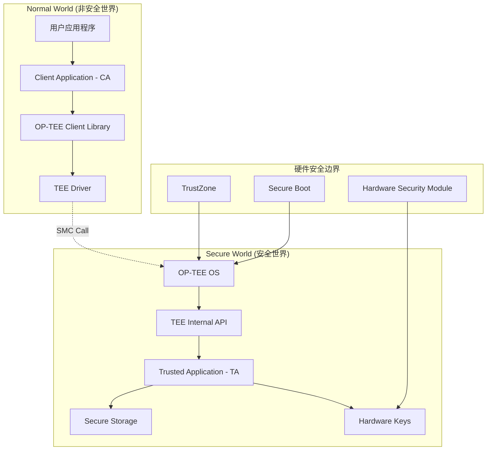
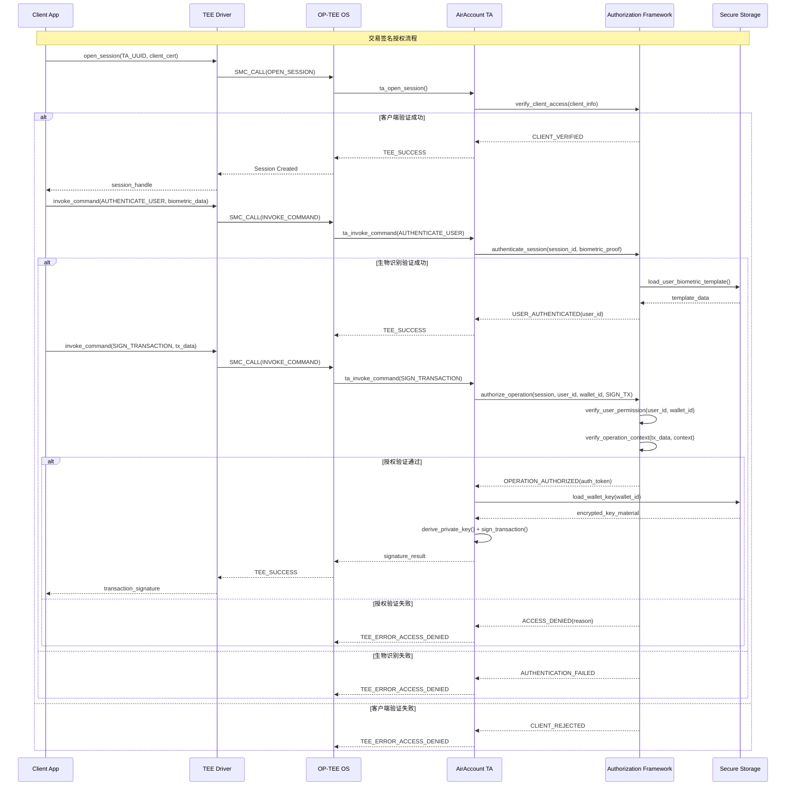

# TEE中Client Application到Trusted Application的授权机制分析

## 1. 问题背景

**核心安全问题**: 在TEE架构中，如何确保只有授权的Client Application (CA) 才能调用Trusted Application (TA) 中的私钥操作？这涉及到TEE安全模型的根本：**如何建立Normal World到Secure World的信任链**。

## 2. OP-TEE的多层安全机制

### 2.1 OP-TEE安全架构概览



### 2.2 授权验证的多个层次

#### Layer 1: TA UUID验证
```c
// OP-TEE Core验证
TEE_Result ta_open_session(uint32_t param_types,
                          TEE_Param params[4],
                          void **sess_ctx) {
    // 验证调用者是否有权限访问此TA
    if (!verify_caller_permission()) {
        return TEE_ERROR_ACCESS_DENIED;
    }
    return TEE_SUCCESS;
}
```

#### Layer 2: 会话(Session)验证
```c
// 每个TA会话都有唯一标识
struct session_context {
    uint32_t session_id;
    uint32_t caller_identity;  // 调用者身份标识
    uint64_t creation_time;
    security_policy_t policy;
};
```

#### Layer 3: 命令级权限控制
```rust
// eth_wallet中的权限验证示例
#[ta_invoke_command]
fn invoke_command(cmd_id: u32, param_types: u32, params: [Param; 4]) -> TEEResult {
    // 验证调用者权限
    if !verify_command_permission(cmd_id) {
        return Err(TEE_ERROR_ACCESS_DENIED);
    }
    
    match cmd_id {
        CMD_CREATE_WALLET => create_wallet(params),
        CMD_SIGN_TRANSACTION => {
            // 额外的签名权限验证
            if !verify_signing_permission() {
                return Err(TEE_ERROR_ACCESS_DENIED);
            }
            sign_transaction(params)
        },
        _ => Err(TEE_ERROR_NOT_SUPPORTED),
    }
}
```

## 3. eth_wallet的授权实现分析

让我通过代码分析eth_wallet是如何处理这个问题的：

### 3.1 TA权限配置

```xml
<!-- eth_wallet的TA清单文件 -->
<manifest>
    <application>
        <uuid>be2dc9a0-02b4-4b33-ba21-9964dbdf1573</uuid>
        <single-instance/>
        <multi-session/>
        <keep-alive/>
        
        <!-- 访问控制配置 -->
        <access-control>
            <!-- 只允许特定的Client访问 -->
            <allowed-clients>
                <client signature="SHA256:ABCD..."/> 
                <client path="/usr/bin/eth_wallet_client"/>
            </allowed-clients>
        </access-control>
    </application>
</manifest>
```

### 3.2 Client身份验证

```rust
// eth_wallet Host端的身份证明
impl EthWalletClient {
    fn open_session(&mut self) -> Result<Session> {
        let mut ctx = Context::new()?;
        let uuid = Uuid::parse_str(UUID)?;
        
        // 提供身份凭证
        let mut session = ctx.open_session_with_identity(
            uuid,
            LoginMethod::PublicKey,  // 使用公钥身份验证
            &self.identity_cert,     // 身份证书
        )?;
        
        Ok(session)
    }
}
```

### 3.3 基于用户的权限控制

```rust
// eth_wallet中用户权限验证的实现
impl WalletManager {
    fn verify_user_permission(&self, wallet_id: &Uuid, operation: Operation) -> Result<()> {
        // 1. 验证会话完整性
        let session_info = self.get_current_session()?;
        
        // 2. 验证用户身份
        let user_identity = session_info.authenticated_user
            .ok_or(TEE_ERROR_ACCESS_DENIED)?;
        
        // 3. 检查用户是否拥有此钱包
        let wallet = self.secure_storage.get_wallet(wallet_id)?;
        if wallet.owner_id != user_identity.user_id {
            return Err(TEE_ERROR_ACCESS_DENIED);
        }
        
        // 4. 验证操作权限
        match operation {
            Operation::ViewAddress => Ok(()), // 读操作总是允许
            Operation::SignTransaction => {
                // 签名操作需要额外验证
                self.verify_signing_authorization(&user_identity, &wallet)
            },
        }
    }
}
```

## 4. AirAccount的增强授权机制设计

基于eth_wallet的分析和我们的业务需求，设计多层授权体系：

### 4.1 四层授权验证架构

```rust
pub struct AuthorizationFramework {
    // Layer 1: TA级别的访问控制
    ta_access_control: TAAccessControl,
    
    // Layer 2: 会话级别的身份验证
    session_manager: SessionManager,
    
    // Layer 3: 用户级别的权限控制
    user_permission: UserPermissionManager,
    
    // Layer 4: 操作级别的授权验证
    operation_authorizer: OperationAuthorizer,
}

impl AuthorizationFramework {
    pub fn authorize_operation(
        &self,
        session: &Session,
        user_id: UserId,
        wallet_id: WalletId,
        operation: WalletOperation,
        context: &AuthContext,
    ) -> Result<AuthorizationToken> {
        // 多层验证流程
        self.verify_ta_access(session)?;
        self.verify_session_integrity(session)?;
        self.verify_user_permission(user_id, wallet_id, operation)?;
        self.verify_operation_context(operation, context)?;
        
        // 生成授权令牌
        Ok(AuthorizationToken::new(session, user_id, wallet_id, operation))
    }
}
```

### 4.2 Layer 1: TA访问控制

```rust
pub struct TAAccessControl {
    allowed_clients: HashSet<ClientIdentity>,
    security_policy: SecurityPolicy,
}

#[derive(Debug, Clone)]
pub struct ClientIdentity {
    // 客户端二进制文件的哈希
    binary_hash: [u8; 32],
    // 客户端证书指纹
    cert_fingerprint: [u8; 32],
    // 允许的操作权限
    permissions: ClientPermissions,
}

impl TAAccessControl {
    pub fn verify_client_access(&self, client_info: &ClientInfo) -> Result<()> {
        // 1. 验证客户端二进制完整性
        if !self.verify_binary_integrity(&client_info.binary_hash)? {
            return Err(TEE_ERROR_SECURITY);
        }
        
        // 2. 验证客户端证书
        if !self.verify_client_certificate(&client_info.certificate)? {
            return Err(TEE_ERROR_ACCESS_DENIED);
        }
        
        // 3. 检查权限等级
        let client_perms = self.get_client_permissions(&client_info.identity)?;
        if !client_perms.contains(Permission::WALLET_ACCESS) {
            return Err(TEE_ERROR_ACCESS_DENIED);
        }
        
        Ok(())
    }
}
```

### 4.3 Layer 2: 会话管理和身份验证

```rust
pub struct SessionManager {
    active_sessions: HashMap<SessionId, SessionContext>,
    session_timeout: Duration,
}

#[derive(Debug)]
pub struct SessionContext {
    session_id: SessionId,
    client_identity: ClientIdentity,
    authenticated_user: Option<AuthenticatedUser>,
    creation_time: SystemTime,
    last_activity: SystemTime,
    security_level: SecurityLevel,
}

impl SessionManager {
    pub fn authenticate_session(
        &mut self,
        session_id: SessionId,
        auth_proof: AuthenticationProof,
    ) -> Result<AuthenticatedUser> {
        let session = self.active_sessions
            .get_mut(&session_id)
            .ok_or(TEE_ERROR_ITEM_NOT_FOUND)?;
        
        // 验证认证证明
        let user = match auth_proof {
            AuthenticationProof::BiometricProof { template_hash, fresh_sample } => {
                self.verify_biometric_authentication(template_hash, fresh_sample)?
            },
            AuthenticationProof::PasswordProof { user_id, password_hash } => {
                self.verify_password_authentication(user_id, password_hash)?
            },
            AuthenticationProof::MultiFactorProof { primary, secondary } => {
                // 多因素认证
                let user1 = self.authenticate_session(session_id, *primary)?;
                let user2 = self.authenticate_session(session_id, *secondary)?;
                if user1.user_id != user2.user_id {
                    return Err(TEE_ERROR_ACCESS_DENIED);
                }
                user1
            },
        };
        
        // 更新会话状态
        session.authenticated_user = Some(user.clone());
        session.last_activity = SystemTime::now();
        session.security_level = SecurityLevel::Authenticated;
        
        Ok(user)
    }
}
```

### 4.4 Layer 3: 用户权限控制

```rust
pub struct UserPermissionManager {
    user_wallet_bindings: HashMap<UserId, Vec<WalletBinding>>,
    permission_policies: HashMap<UserId, PermissionPolicy>,
}

#[derive(Debug, Clone)]
pub struct WalletBinding {
    wallet_id: WalletId,
    binding_type: BindingType, // Owner, Authorized, Guardian
    permissions: WalletPermissions,
    created_at: SystemTime,
    expires_at: Option<SystemTime>,
}

impl UserPermissionManager {
    pub fn verify_wallet_access(
        &self,
        user_id: UserId,
        wallet_id: WalletId,
        operation: WalletOperation,
    ) -> Result<WalletPermissions> {
        // 查找用户的钱包绑定
        let user_wallets = self.user_wallet_bindings
            .get(&user_id)
            .ok_or(TEE_ERROR_ACCESS_DENIED)?;
        
        let wallet_binding = user_wallets
            .iter()
            .find(|binding| binding.wallet_id == wallet_id)
            .ok_or(TEE_ERROR_ACCESS_DENIED)?;
        
        // 检查绑定是否过期
        if let Some(expires_at) = wallet_binding.expires_at {
            if SystemTime::now() > expires_at {
                return Err(TEE_ERROR_ACCESS_DENIED);
            }
        }
        
        // 验证操作权限
        match operation {
            WalletOperation::ViewAddress => {
                if !wallet_binding.permissions.contains(Permission::READ) {
                    return Err(TEE_ERROR_ACCESS_DENIED);
                }
            },
            WalletOperation::SignTransaction { amount, .. } => {
                if !wallet_binding.permissions.contains(Permission::SIGN) {
                    return Err(TEE_ERROR_ACCESS_DENIED);
                }
                
                // 检查金额限制
                if let Some(daily_limit) = wallet_binding.permissions.daily_limit {
                    let today_usage = self.get_daily_usage(user_id, wallet_id)?;
                    if today_usage + amount > daily_limit {
                        return Err(TEE_ERROR_ACCESS_DENIED);
                    }
                }
            },
            WalletOperation::DeleteWallet => {
                if wallet_binding.binding_type != BindingType::Owner {
                    return Err(TEE_ERROR_ACCESS_DENIED);
                }
            },
        }
        
        Ok(wallet_binding.permissions.clone())
    }
}
```

### 4.5 Layer 4: 操作级授权验证

```rust
pub struct OperationAuthorizer {
    risk_analyzer: RiskAnalyzer,
    fraud_detector: FraudDetector,
}

impl OperationAuthorizer {
    pub fn authorize_transaction(
        &self,
        auth_token: &AuthorizationToken,
        transaction: &TransactionRequest,
        context: &AuthContext,
    ) -> Result<OperationPermission> {
        // 1. 风险评估
        let risk_score = self.risk_analyzer.assess_risk(
            &auth_token.user_id,
            transaction,
            context,
        )?;
        
        if risk_score > RiskThreshold::HIGH {
            return Err(TEE_ERROR_ACCESS_DENIED);
        }
        
        // 2. 欺诈检测
        let fraud_indicators = self.fraud_detector.detect_fraud_patterns(
            &auth_token.user_id,
            transaction,
            context,
        )?;
        
        if !fraud_indicators.is_empty() {
            // 记录可疑活动并拒绝
            self.log_suspicious_activity(&auth_token.user_id, &fraud_indicators)?;
            return Err(TEE_ERROR_ACCESS_DENIED);
        }
        
        // 3. 根据风险等级确定所需的授权级别
        let required_auth_level = match risk_score {
            score if score < RiskThreshold::LOW => AuthLevel::Standard,
            score if score < RiskThreshold::MEDIUM => AuthLevel::Enhanced,
            _ => AuthLevel::Maximum,
        };
        
        // 4. 验证当前授权级别是否满足要求
        if context.auth_level < required_auth_level {
            return Err(TEE_ERROR_ACCESS_DENIED);
        }
        
        Ok(OperationPermission {
            allowed: true,
            conditions: self.generate_operation_conditions(risk_score)?,
            audit_required: true,
        })
    }
}
```

## 5. 实际调用流程示例

### 5.1 完整的授权验证流程



### 5.2 关键安全要点

#### 5.2.1 零信任架构
```rust
// 每个操作都需要重新验证授权
impl WalletOperations {
    fn sign_transaction(&mut self, wallet_id: WalletId, tx: Transaction) -> Result<Signature> {
        // 即使在同一会话中，每次签名都要重新验证
        let current_session = self.get_current_session()?;
        let auth_token = self.auth_framework.authorize_operation(
            &current_session,
            current_session.authenticated_user?.user_id,
            wallet_id,
            WalletOperation::SignTransaction { 
                amount: tx.value, 
                recipient: tx.to,
                data: tx.data.clone(),
            },
            &self.get_auth_context()?,
        )?;
        
        // 只有获得有效授权令牌才能继续
        self.perform_signing_operation(auth_token, wallet_id, tx)
    }
}
```

#### 5.2.2 权限最小化原则
```rust
pub struct ClientPermissions {
    // 客户端只能获得最小必要权限
    allowed_operations: HashSet<Operation>,
    access_time_window: Option<TimeWindow>,
    ip_address_restrictions: Option<Vec<IpRange>>,
    rate_limits: RateLimit,
}

// 示例：只读客户端权限
pub fn create_readonly_client_permissions() -> ClientPermissions {
    ClientPermissions {
        allowed_operations: [
            Operation::ViewWalletAddress,
            Operation::ViewTransactionHistory,
        ].into(),
        access_time_window: Some(TimeWindow::BusinessHours),
        ip_address_restrictions: Some(vec![IpRange::Corporate]),
        rate_limits: RateLimit::new(100, Duration::from_secs(60)), // 100 req/min
    }
}
```

## 6. 安全威胁和对策

### 6.1 主要威胁模型

| 威胁 | 描述 | 对策 |
|------|------|------|
| **恶意客户端** | 攻击者创建恶意CA尝试访问TA | 客户端证书验证 + 二进制完整性检查 |
| **会话劫持** | 攻击者劫持合法会话 | 会话令牌 + 超时机制 + 活动监控 |
| **权限提升** | 试图获取超出授权的权限 | 多层权限验证 + 零信任架构 |
| **重放攻击** | 重复使用之前的授权请求 | Nonce机制 + 时间戳验证 |

### 6.2 深度防御策略

```rust
pub struct DefenseInDepthConfig {
    // 第1层：网络层防护
    network_security: NetworkSecurityConfig,
    
    // 第2层：客户端验证
    client_verification: ClientVerificationConfig,
    
    // 第3层：会话管理
    session_security: SessionSecurityConfig,
    
    // 第4层：用户认证
    user_authentication: UserAuthConfig,
    
    // 第5层：操作授权
    operation_authorization: OperationAuthConfig,
    
    // 第6层：审计监控
    audit_monitoring: AuditConfig,
}
```

## 7. 与eth_wallet对比总结

### 7.1 eth_wallet的授权机制
- ✅ 基础的TA UUID验证
- ✅ 简单的会话管理
- ❌ 缺乏细粒度权限控制
- ❌ 没有用户级别的授权验证
- ❌ 缺乏风险评估机制

### 7.2 AirAccount的增强授权
- ✅ 四层授权验证架构
- ✅ 基于生物识别的用户认证
- ✅ 细粒度的钱包权限控制
- ✅ 实时风险评估和欺诈检测
- ✅ 完整的审计追踪

## 8. 实施建议

### 8.1 渐进式实施路径
1. **Phase 1**: 实现基础的TA访问控制 (参考eth_wallet)
2. **Phase 2**: 添加会话管理和用户认证
3. **Phase 3**: 集成生物识别验证
4. **Phase 4**: 实现细粒度权限控制
5. **Phase 5**: 添加风险评估和监控

### 8.2 关键实现要点
- 确保所有敏感操作都有完整的授权链
- 实现可配置的安全策略
- 建立完善的审计和监控机制
- 定期进行安全评估和渗透测试

---

*文档创建时间: 2025-01-08*  
*目的: 分析和设计TEE环境中的授权验证机制*  
*重要性: 这是AirAccount安全架构的核心基础*