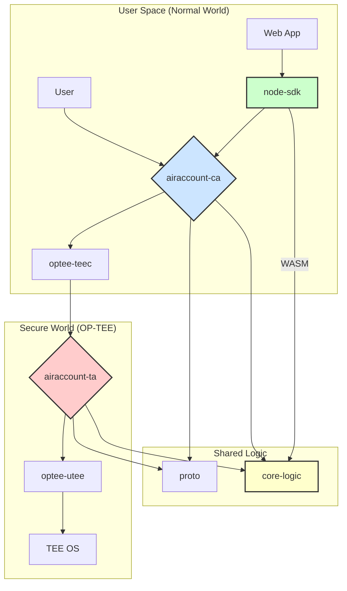
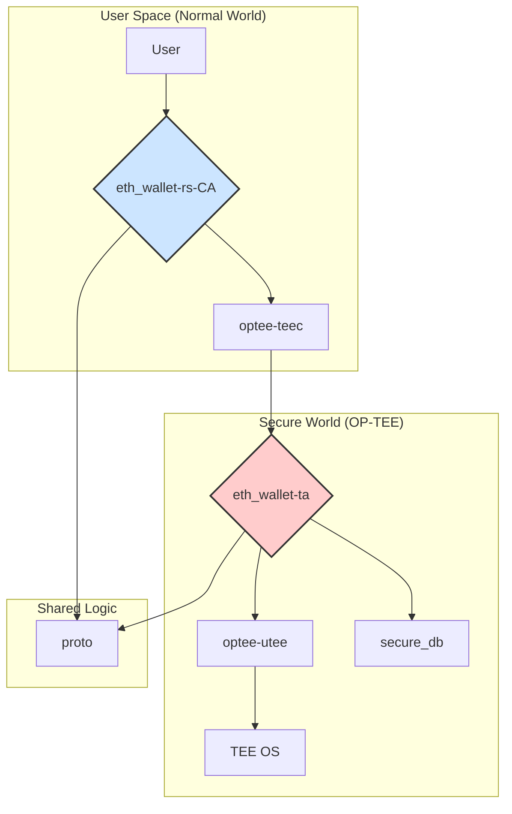
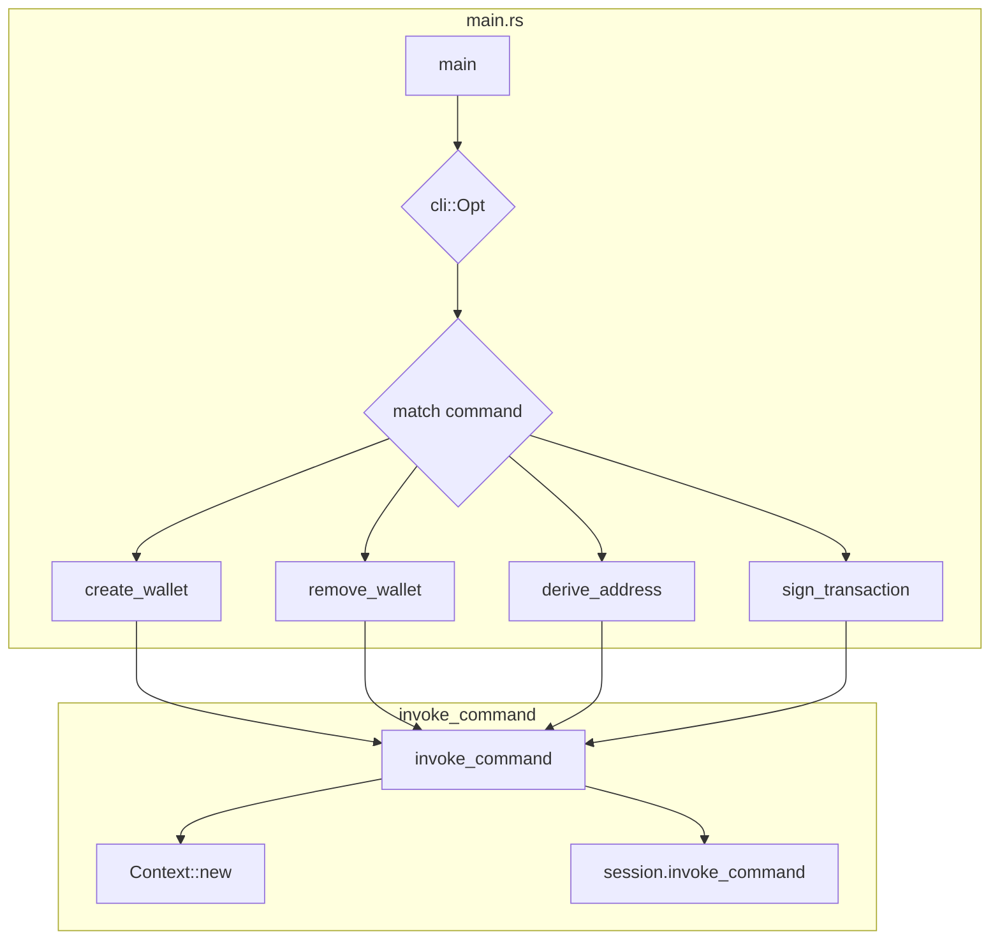
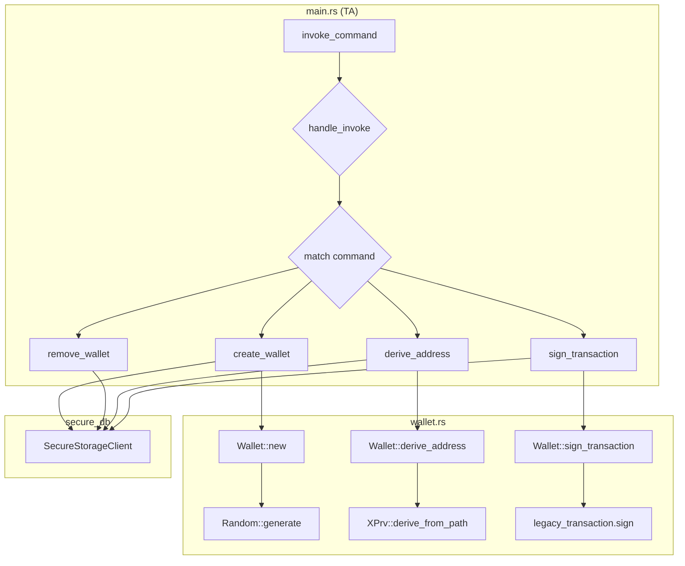
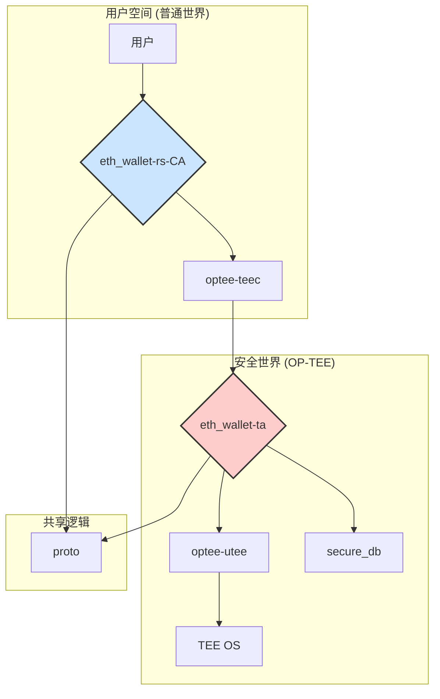

# AirAccount Component Architecture

This document outlines the component-level architecture of the AirAccount system.

## Components

*   **User:** The end-user interacting with the system through a client application.
*   **airaccount-ca (Client Application):** A command-line application running in the Normal World. It serves as the primary interface for users to interact with the AirAccount wallet. It handles user input and communicates with the Trusted Application (TA) in the Secure World.
*   **optee-teec:** A library that provides the API for Normal World applications to communicate with TEEs running OP-TEE.
*   **node-sdk:** A Node.js SDK that allows developers to integrate AirAccount functionality into their JavaScript/TypeScript applications. It likely uses a WebAssembly (WASM) compiled version of the `core-logic`.
*   **Web App:** A web application that uses the `node-sdk` to interact with the AirAccount system.
*   **airaccount-ta (Trusted Application):** A secure application running in the OP-TEE Secure World. It is responsible for all sensitive operations, including key generation, storage, and transaction signing.
*   **optee-utee:** A library that provides the API for Trusted Applications to interact with the underlying TEE OS.
*   **TEE OS:** The Trusted Execution Environment operating system (in this case, OP-TEE).
*   **core-logic:** A hardware-agnostic library containing the core business logic of the AirAccount system. This includes cryptographic functions, wallet management, and security features. It is designed to be reusable across different TEE platforms.
*   **proto:** A library that defines the data structures and communication protocol used between the CA and the TA.

## Flow

1.  The **User** interacts with a **Web App** or the **airaccount-ca**.
2.  The client application (either **airaccount-ca** or a **Web App** using the **node-sdk**) uses the **proto** library to construct a request.
3.  The **airaccount-ca** uses the **optee-teec** library to send the request to the **airaccount-ta** in the Secure World.
4.  The **airaccount-ta** receives the request, uses the **proto** library to deserialize it, and then uses the **core-logic** library to perform the requested operation.
5.  The **airaccount-ta** uses the **optee-utee** library to interact with the **TEE OS** for hardware-level security features.
6.  The **airaccount-ta** sends a response back to the **airaccount-ca**.
7.  The **airaccount-ca** or **Web App** displays the result to the **User**.

# eth-wallet Example Architecture Analysis

This section analyzes the architecture of the `eth-wallet` example from the `incubator-teaclave-trustzone-sdk`.

## Component-Level Architecture

## Function-Level Architecture

### `eth_wallet-rs` (CA - Client Application)

### `eth_wallet-ta` (TA - Trusted Application)

## Architecture Comparison: AirAccount vs. eth-wallet

| Feature | eth-wallet | AirAccount | Analysis |
| --- | --- | --- | --- |
| **Core Logic** | Tightly coupled within the TA | Decoupled into a hardware-agnostic `core-logic` crate | AirAccount's architecture is more modular and reusable, allowing for easier adaptation to different TEE platforms. |
| **SDK** | Command-line tool only | Provides a `node-sdk` for web applications | AirAccount is designed for a broader range of applications, including web-based ones. |
| **Authentication** | Mnemonic-based | WebAuthn integration | AirAccount offers a more modern and user-friendly authentication mechanism. |
| **Protocol** | Simple command/response | Sophisticated request/response with more command types | AirAccount's protocol is more robust and extensible. |
| **Security** | Basic secure storage | Advanced features like hybrid entropy | AirAccount incorporates more advanced security concepts. |
| **Modularity** | Monolithic TA | Highly modular with clear separation of concerns | AirAccount's design is more maintainable and scalable. |

---

# eth-wallet 范例架构分析

本节分析 `incubator-teaclave-trustzone-sdk` 中的 `eth-wallet` 范例的架构。

## 组件级别架构

## 函数级别架构

### `eth_wallet-rs` (CA - 客户端应用程序)

### `eth_wallet-ta` (TA - 可信应用程序)

## 架构对比: AirAccount vs. eth-wallet

| 功能 | eth-wallet | AirAccount | 分析 |
| --- | --- | --- | --- |
| **核心逻辑** | 与 TA 紧密耦合 | 解耦到硬件无关的 `core-logic` crate | AirAccount 的架构更模块化、更易于重用，可以轻松适应不同的 TEE 平台。 |
| **SDK** | 仅命令行工具 | 提供用于 Web 应用程序的 `node-sdk` | AirAccount 旨在用于更广泛的应用程序，包括基于 Web 的应用程序。 |
| **身份验证** | 基于助记词 | WebAuthn 集成 | AirAccount 提供了更现代化、更友好的用户身份验证机制。 |
| **协议** | 简单的命令/响应 | 具有更多命令类型的复杂请求/响应 | AirAccount 的协议更健壮、更具可扩展性。 |
| **安全性** | 基本的安全存储 | 混合熵等高级功能 | AirAccount 融合了更高级的安全概念。 |
| **模块化** | 单体 TA | 高度模块化，关注点分离清晰 | AirAccount 的设计更易于维护和扩展。 |
