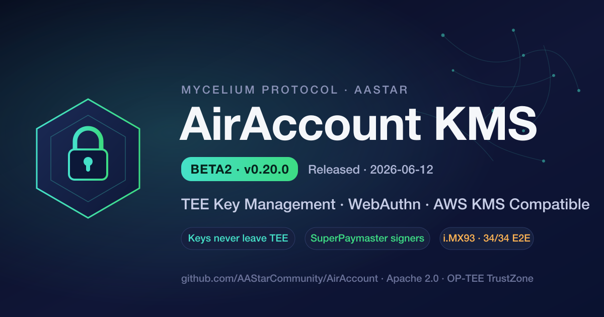

# AirAccount KMS Beta2 (v0.20.0) 发布

> 2026-06-12 · Mycelium Protocol 生态 · AAStar

AirAccount 是 [Mycelium Protocol](https://www.mushroom.cv) 生态的**身份与密钥底层** —— TEE 私钥管理 + WebAuthn 无密码认证 + AWS KMS 兼容 API。SuperPaymaster 依赖它做账户验证,SuperRelay 依赖它做 TEE 双签。今天发布 **Beta2 (v0.20.0)**。

## 一句话

私钥永不出 TEE,每次签名都需要一次**实时、防重放的 WebAuthn ceremony**;以太坊 secp256k1 钱包密钥 + RPMB 硬件反回滚。

## Beta2 的核心

### 🔒 安全加固
- 完成一轮完整安全审计,**P0/High 全部修复**(命令 ID 唯一性、TEE 调用超时+熔断、passkey 强制、submodule 锁定)。
- **TA 侧 WebAuthn 独立验签**(rpId + User-Presence)—— 被攻陷的 host 无法绕过用户在场证明。
- **RPMB 硬件反回滚** + 钱包存储(REE-FS fallback);新增 `ReadRollbackCounter` + `GET /RollbackCounter`。
- WebAuthn ceremony 覆盖全部签名路径,旧的可重放 passkey 路径已下线。

### 🔗 SuperPaymaster 对齐(gasless 支付)
不用自己拼 EIP-712 —— KMS 直接提供三个便利签名端点,内部构造合约级正确的 typed-data,走同样的 ceremony 鉴权:
- **SignMicropaymentVoucher** —— 微支付通道凭证(高频小额、按用量付费)
- **SignGTokenAuthorization** —— EIP-3009 `TransferWithAuthorization`(无 gas 转账)
- **SignX402Payment** —— x402 协议支付载荷(API 按调用付费、agent 机器支付)

### 🛠️ 真机生产部署(NXP FRDM-IMX93)
- ARM Cortex-A55 + OP-TEE 4.8 完整部署。
- i.MX93 的 CAAM TRNG 不稳定?CA 侧用 OsRng 生成熵注入 TA,绕过硬件卡死(**CAAM-bypass**)。
- gap key(无效 P-256 pubkey)的 TEE 强制清理、自动备份系统、dirf.db 自愈。
- 修复了一个真机才暴露的 TA panic:agent-key 路径用 `std::time::SystemTime::now()` 在 OP-TEE 崩溃,改用 `TEE_GetREETime`。

### ✅ 质量
- **真机端到端测试 100% 端点覆盖:FRDM-IMX93 上 34/34 通过**(含注册/认证 ceremony、agent key、grant session、p256 session、EIP-712)。
- 单元测试:proto 39 + host 56(交叉编译 aarch64 上板运行)。

### ⚖️ 合规
- Apache 2.0 license 合规(NOTICE / TRADEMARK / 中文 license)+ CLA workflow。

## 对生态伙伴意味着什么
- **SuperPaymaster**:gasless 支付的 TEE 双签端点已齐全,可直接对接。
- **SDK 集成方**:`@aastar/sdk` 可调用新便利端点,免去 EIP-712 拼装与踩坑。
- **开发者**:一行 API 拿到合约级正确、私钥不出 TEE 的签名。

## 路线图
- **Beta3**:WebAuthn challenge binding([#49](https://github.com/AAStarCommunity/AirAccount/issues/49))、密钥生命周期([#42](https://github.com/AAStarCommunity/AirAccount/issues/42))、便利签名器 from 校验([#52](https://github.com/AAStarCommunity/AirAccount/issues/52))。
- **主网前必须**:RPMB 生产编程([#50](https://github.com/AAStarCommunity/AirAccount/issues/50))、TEE 远程证明([#37](https://github.com/AAStarCommunity/AirAccount/issues/37))。

完整变更见 [CHANGELOG 0.20.0](../kms/CHANGELOG.md)。

---

*AirAccount · github.com/AAStarCommunity/AirAccount · Apache 2.0*
