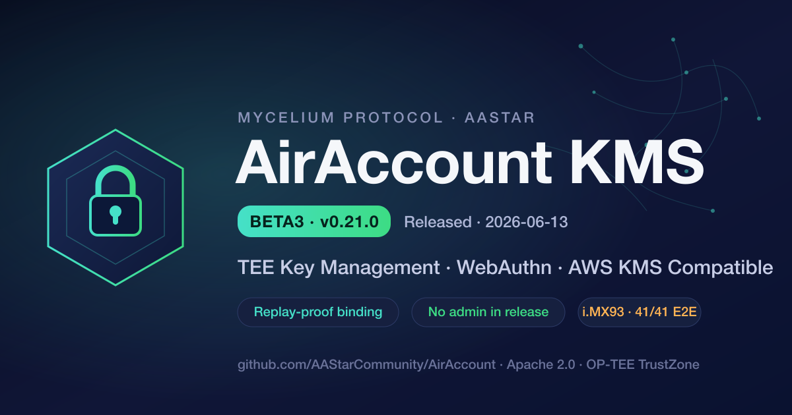

# AirAccount KMS Beta3 (v0.21.0) 发布

> 2026-06-13 · Mycelium Protocol 生态 · AAStar

AirAccount 是 [Mycelium Protocol](https://www.mushroom.cv) 生态的**身份与密钥底层** —— TEE 私钥管理 + WebAuthn 无密码认证 + AWS KMS 兼容 API。SuperPaymaster 依赖它做账户验证,SuperRelay 依赖它做 TEE 双签。今天发布 **Beta3 (v0.21.0)**,主题:**安全加固 + 生态对齐**。

## 一句话

私钥永不出 TEE;每次签名都需要一次**实时、防重放的 WebAuthn ceremony**,而 Beta3 把这道防线**下沉进了 TA**——即使运行 KMS 的服务器被完全攻陷,也无法重放一条捕获的签名授权。

## Beta3 的核心

### 🔒 WebAuthn challenge binding 下沉到 TA(关闭 H-2 重放)
Beta2 的 TA 只验 ECDSA 签名,不校验 clientDataJSON 里的 challenge ——被攻陷的 CA 理论上能用一条捕获的 assertion 重放授权任意 payload。Beta3 把 challenge 校验**搬进 TrustZone**:
- 新增 `GetChallenge` TA 命令,TA 用硬件 TRNG 生成 32 字节**一次性 nonce**,绑定 wallet 存入 TA 内存。
- 验签时 TA 自己比对 `SHA-256(clientDataJSON) == client_data_hash` → 提取 challenge → 常量时间比对自己签发的 nonce → 校验未过期(TTL 300s)→ **用后即焚**。
- 即使 CA 被攻陷,捕获的 assertion 也无法重放:nonce 一次性 + TA 内消费 + JSON↔hash 绑定。这是主网信任链的关键一块。

### 🧊 去中心化:正式版没有 admin
AirAccount 是**半去中心化 KMS** —— owner 拥有自己 key 的全部权利,没有 admin、没有超级用户。Beta3 把这条原则编译进了二进制:
- `/admin/purge-key` 这类危险运维端点移到 **compile-time feature**(`admin-purge`),**正式 release 构建里物理上不存在**(二进制零 admin symbol,实测确认),不是运行时 env 开关那种能被"复活"的假门控。
- **久置密钥保护(#42)**:长期不用的 key 后台自动 `frozen`,要 owner 的 WebAuthn ceremony 才能 `UnfreezeKey` 解冻——多一道时间维度的验证门槛,owner 始终自主,无需任何管理员。

### 🔗 生态对齐 + 防坑
- **GToken 便利签名器 `from` 绑定(#52)**:EIP-3009 `TransferWithAuthorization` 链上由 `ecrecover==from` 校验,Beta3 在签名前就校验 `from` == 你 key 派生的真实地址,把一次链上 revert(白烧 gas)挡在源头。
- **TA 侧 JWT 运行时过期(#15)**:agent JWT 的过期判断用 TEE 自己的可信时间源,不再只做结构检查。
- **EIP-712 domain 对齐(#21)**:MicroPaymentChannel domain version 对齐合约。
- **生产容量**:钱包上限从过度保守的 100 提到 **30000**(实测一个钱包仅 ~5KB,板子有 GB 级 REE-FS 空间),社区/城市级部署够用,仍保留硬性 DoS 上限。

### ✅ 质量:对抗式审查 + 真机验证
- **真机端到端测试 100% 端点覆盖:FRDM-IMX93 上 41/41 通过**;另有防重放/DoS 专项 4/4、密钥冻结/解冻 5/5、host 单元 63/63。
- **多轮对抗式 review 全部通过**:外部 4-round PK review(DeepSeek / Sonnet / Codex / Opus)+ Codex 多轮独立审查,逐条 finding 修复或给出有据的接受理由。一个 review 抓到的 DoS-on-nonce(错误 challenge 烧合法 nonce)已修复并加回归测试。

## 对生态伙伴意味着什么
- **SuperPaymaster / SuperRelay**:签名授权现在有了 TA 级防重放,主网双签更可信。
- **SDK 集成方**:GToken / x402 / 微支付便利端点更稳——`from` 校验帮你避开链上 revert。
- **运维**:正式版没有 admin 面,部署即去中心化,无需担心"谁拿到了管理员密钥"。

## 路线图(主网前必须)
- **challenge-binding 收尾**([#63](https://github.com/AAStarCommunity/AirAccount/issues/63)):grant-session 走 TA 侧 binding、`ENFORCE_TA_CHALLENGE` 翻到 strict。
- **RPMB 生产编程**([#50](https://github.com/AAStarCommunity/AirAccount/issues/50)):secp256k1 私钥的硬件防回滚,硬件定版后一次性编程。
- **TEE 远程证明**([#37](https://github.com/AAStarCommunity/AirAccount/issues/37)):让客户端密码学验证签名来自真实 OP-TEE。

完整变更见 [CHANGELOG 0.21.0](../kms/CHANGELOG.md)。

---

*AirAccount · github.com/AAStarCommunity/AirAccount · Apache 2.0*
