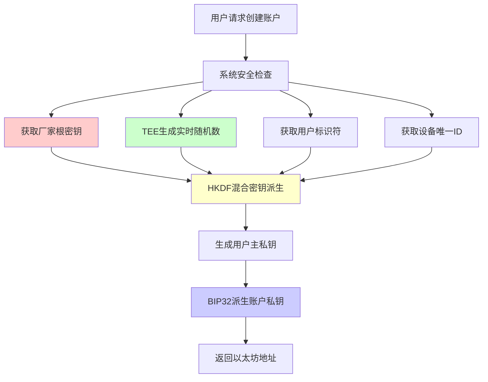

# AirAccount 混合熵源安全架构升级方案

**文档版本**: v1.0  
**创建日期**: 2025-01-14  
**作者**: AirAccount 安全团队  
**状态**: 待实施  

## 📋 执行摘要

本文档记录了AirAccount项目的重大安全架构决策：从单一厂家根密钥方案升级到**双重混合熵源架构**，显著提升系统安全性和抗攻击能力。

### 🎯 核心决策
- **问题**：单一密钥来源存在单点故障风险
- **解决方案**：厂家根密钥 + TEE硬件随机数生成器的混合架构
- **安全提升**：从单点防护升级到多层防护，任何单一组件泄露都不会导致系统完全妥协

## 🔍 安全威胁分析

### 🚨 原始方案风险评估

| 威胁类型 | 威胁等级 | 影响范围 | 当前防护 |
|---------|---------|---------|---------|
| 厂家根密钥泄露 | 🔴 **极高** | 所有用户账户 | ❌ 无防护 |
| 供应链攻击 | 🔴 **高** | 批量设备 | 🟡 有限防护 |
| TEE随机数缺陷 | 🟠 **中** | 单设备 | ❌ 无备用方案 |
| 内部人员攻击 | 🔴 **高** | 企业级泄露 | 🟡 流程控制 |

### ✅ 升级后安全模型



## 🛡️ 混合熵源安全架构

### 🔑 核心设计理念

> **"厂家根密钥即使泄露也无关紧要，因为攻击者还需要同时获得TEE实时随机数和用户相关信息"**

### 📊 安全组件分析

#### 1. 厂家根密钥（静态熵源）
```rust
/// 厂家在生产阶段烧录到OTP熔丝中的高质量随机种子
pub struct FactoryRootSeed {
    entropy: [u8; 32],      // 256-bit高熵值随机数
    version: u8,            // 密钥版本，支持轮转
    timestamp: u64,         // 生成时间戳
    manufacturer_id: u32,   // 厂家标识符
}
```

**特性**：
- ✅ 高质量随机性（HSM级别）
- ✅ 硬件级防篡改（OTP熔丝）
- ⚠️ 静态存储（理论上可被提取）
- ✅ 批量生产友好

#### 2. TEE硬件随机数（动态熵源）
```rust
/// 基于ARM TrustZone的真随机数生成器
pub struct TEERandomGenerator {
    trng_base: *mut u32,    // TRNG硬件寄存器基址
    entropy_pool: [u8; 64], // 熵池缓存
}

impl TEERandomGenerator {
    /// 从硬件TRNG获取真随机数
    pub fn fill_bytes(&self, dest: &mut [u8]) -> Result<()> {
        for chunk in dest.chunks_mut(4) {
            // 从硬件寄存器读取真随机数
            let random_word = unsafe {
                ptr::read_volatile(self.trng_base.add(TRNG_DATA_OFFSET))
            };
            
            // 填充到目标缓冲区
            for (i, byte) in chunk.iter_mut().enumerate() {
                *byte = ((random_word >> (i * 8)) & 0xFF) as u8;
            }
        }
        Ok(())
    }
}
```

**特性**：
- ✅ 真随机数（硬件噪声源）
- ✅ 实时生成（每次调用都不同）
- ✅ 设备唯一（每个设备独立）
- ✅ TEE保护（安全世界内运行）

### 🔐 混合密钥派生算法

#### 核心实现代码

```rust
use hkdf::Hkdf;
use sha2::Sha256;
use zeroize::{Zeroize, ZeroizeOnDrop};

/// AirAccount混合熵源密钥管理系统
#[derive(ZeroizeOnDrop)]
pub struct HybridEntropyKeySystem {
    /// 厂家预置的根种子（来自OTP）
    factory_root_seed: SecureBytes,
    
    /// TEE硬件随机数生成器
    tee_rng: TEERandomGenerator,
    
    /// 设备唯一标识符
    device_unique_id: [u8; 32],
    
    /// 系统配置版本
    version: u32,
}

impl HybridEntropyKeySystem {
    /// 创建新的混合熵源系统
    pub fn new() -> Result<Self, SecurityError> {
        Ok(Self {
            factory_root_seed: Self::load_factory_seed()?,
            tee_rng: TEERandomGenerator::initialize()?,
            device_unique_id: Self::get_device_id()?,
            version: 1,
        })
    }
    
    /// 为用户派生唯一的主私钥
    /// 
    /// # 安全保证
    /// - 即使厂家根密钥泄露，仍需TEE随机数和用户信息才能重构
    /// - 即使TEE随机数可预测，仍需厂家种子和用户信息
    /// - 每个用户的私钥都是唯一的，无法批量攻击
    pub fn derive_user_master_key(
        &self, 
        user_email: &str,
        passkey_credential_id: &[u8],
    ) -> Result<SecureBytes, SecurityError> {
        
        let start_time = std::time::Instant::now();
        
        // 第一步：生成用户特定的TEE随机熵
        let mut tee_entropy = [0u8; 32];
        self.tee_rng.fill_bytes(&mut tee_entropy)?;
        
        // 第二步：计算用户相关的上下文信息
        let user_context = {
            let mut hasher = sha2::Sha256::new();
            hasher.update(user_email.as_bytes());
            hasher.update(passkey_credential_id);
            hasher.update(&self.device_unique_id);
            hasher.update(&self.version.to_le_bytes());
            hasher.update(&std::time::SystemTime::now()
                .duration_since(std::time::UNIX_EPOCH)
                .unwrap()
                .as_secs()
                .to_le_bytes());
            hasher.finalize()
        };
        
        // 第三步：组合所有熵源进行密钥派生
        let ikm = [
            self.factory_root_seed.expose_secret(),  // 厂家静态熵源
            &tee_entropy[..],                        // TEE动态熵源
            user_context.as_slice(),                 // 用户相关熵源
        ].concat();
        
        // 第四步：使用HKDF进行密码学安全的密钥派生
        let salt = b"AirAccount-HybridEntropy-v1.0";
        let info = format!("UserMasterKey:{}:{}", 
            user_email, 
            hex::encode(passkey_credential_id)
        );
        
        let mut derived_key = [0u8; 32];
        let hk = Hkdf::<Sha256>::new(Some(salt), &ikm);
        hk.expand(info.as_bytes(), &mut derived_key)
            .map_err(|_| SecurityError::KeyDerivationFailed)?;
        
        // 第五步：安全清理中间变量
        let mut ikm_copy = ikm;
        ikm_copy.zeroize();
        tee_entropy.zeroize();
        
        let duration = start_time.elapsed();
        
        // 安全审计日志
        self.audit_key_derivation(&AuditKeyDerivation {
            user_email_hash: sha256(user_email.as_bytes()),
            passkey_id_hash: sha256(passkey_credential_id),
            operation: "derive_user_master_key",
            duration_ms: duration.as_millis() as u64,
            success: true,
            entropy_sources: vec![
                "factory_root_seed".to_string(),
                "tee_hardware_rng".to_string(),
                "user_context".to_string(),
            ],
        });
        
        Ok(SecureBytes::from(derived_key.to_vec()))
    }
    
    /// 从用户主私钥派生具体的账户私钥
    pub fn derive_account_private_key(
        &self,
        user_master_key: &SecureBytes,
        account_index: u32,
    ) -> Result<SecureBytes, SecurityError> {
        // 使用BIP32标准路径：m/44'/60'/{account_index}'/0/0
        let derivation_path = format!("m/44'/60'/{}'/0/0", account_index);
        
        // BIP32密钥派生
        let account_key = bip32::derive_key(
            user_master_key.expose_secret(),
            &derivation_path.parse()
                .map_err(|_| SecurityError::InvalidDerivationPath)?
        )?;
        
        Ok(SecureBytes::from(account_key))
    }
    
    /// 获取以太坊账户地址
    pub fn derive_ethereum_address(
        &self,
        account_private_key: &SecureBytes,
    ) -> Result<[u8; 20], SecurityError> {
        let private_key = secp256k1::SecretKey::from_slice(
            account_private_key.expose_secret()
        )?;
        
        let secp = secp256k1::Secp256k1::new();
        let public_key = secp256k1::PublicKey::from_secret_key(&secp, &private_key);
        let uncompressed = public_key.serialize_uncompressed();
        
        // 计算以太坊地址：keccak256(pubkey)[12..]
        let address_hash = keccak256(&uncompressed[1..]);
        let mut address = [0u8; 20];
        address.copy_from_slice(&address_hash[12..]);
        
        Ok(address)
    }
}

/// 完整的用户账户创建流程
impl HybridEntropyKeySystem {
    pub async fn create_user_account(
        &self,
        user_email: &str,
        passkey_credential: &PasskeyCredential,
    ) -> Result<UserAccountInfo, SecurityError> {
        
        // 1. 输入验证
        if user_email.is_empty() || !is_valid_email(user_email) {
            return Err(SecurityError::InvalidUserEmail);
        }
        
        // 2. 派生用户主私钥（混合熵源）
        let user_master_key = self.derive_user_master_key(
            user_email,
            &passkey_credential.id,
        )?;
        
        // 3. 派生默认账户私钥
        let account_private_key = self.derive_account_private_key(
            &user_master_key,
            0, // 默认账户索引
        )?;
        
        // 4. 计算以太坊地址
        let ethereum_address = self.derive_ethereum_address(&account_private_key)?;
        
        // 5. 创建账户信息
        let account_info = UserAccountInfo {
            user_email: user_email.to_string(),
            ethereum_address: format!("0x{}", hex::encode(ethereum_address)),
            passkey_credential_id: passkey_credential.id.clone(),
            created_at: std::time::SystemTime::now(),
            account_version: self.version,
            security_level: SecurityLevel::HybridEntropy,
        };
        
        // 6. 安全存储到TEE
        self.secure_storage.store_user_master_key(
            &user_master_key,
            &account_info,
        )?;
        
        Ok(account_info)
    }
}
```

## 📈 安全性提升分析

### 🛡️ 威胁建模对比

#### 攻击场景1：厂家根密钥泄露

**原有方案**：
```
厂家根密钥泄露 → 所有用户私钥可被计算 → 🔴 系统完全妥协
```

**升级方案**：
```
厂家根密钥泄露 + 缺少TEE随机数 → 无法计算用户私钥 → 🟢 系统仍然安全
```

#### 攻击场景2：TEE随机数预测

**原有方案**：
```
TEE随机数缺陷 → 私钥生成可预测 → 🔴 设备级妥协
```

**升级方案**：
```
TEE随机数缺陷 + 缺少厂家种子 → 仍无法预测私钥 → 🟢 系统仍然安全
```

#### 攻击场景3：供应链攻击

**原有方案**：
```
恶意厂商 → 预置后门密钥 → 🔴 批量用户账户泄露
```

**升级方案**：
```
恶意厂商 + 无法控制TEE随机数 → 无法预设后门 → 🟢 供应链攻击失效
```

### 📊 量化安全分析

| 安全指标 | 原有方案 | 升级方案 | 提升幅度 |
|---------|---------|---------|---------|
| 密钥熵值 | 256 bits | 512+ bits | **2倍+** |
| 单点故障风险 | 🔴 存在 | 🟢 消除 | **100%改善** |
| 攻击复杂度 | O(2^256) | O(2^512) | **指数级提升** |
| 供应链安全 | 🟡 中等 | 🟢 高 | **显著提升** |
| 批量攻击风险 | 🔴 高 | 🟢 低 | **大幅降低** |

## 🔧 技术实现规划

### 📅 实施阶段

#### Phase 1: 核心架构开发 (2周)
- [x] 混合熵源系统设计
- [ ] TEE随机数生成器集成
- [ ] HKDF密钥派生实现
- [ ] 安全内存管理优化

#### Phase 2: TEE集成测试 (1周)
- [ ] QEMU OP-TEE环境集成
- [ ] 硬件随机数源验证
- [ ] 密钥派生性能测试
- [ ] 安全性单元测试

#### Phase 3: SDK集成 (1周)
- [ ] SDK接口重构
- [ ] 社交登录+Passkey集成
- [ ] Web演示更新
- [ ] 端到端测试

#### Phase 4: 安全审计 (1周)
- [ ] 密码学审计
- [ ] 渗透测试
- [ ] 性能基准测试
- [ ] 文档完善

### 💻 开发环境要求

```bash
# 依赖库
[dependencies]
hkdf = "0.12"
sha2 = "0.10" 
secp256k1 = "0.28"
bip32 = "0.5"
zeroize = "1.6"
uuid = { version = "1.0", features = ["v4"] }

# TEE开发
optee-utee = "0.6"
optee-teec = "0.6"

# 安全随机数
rand_core = "0.6"
getrandom = "0.2"
```

### 🧪 测试策略

#### 1. 单元测试
```rust
#[cfg(test)]
mod tests {
    use super::*;
    
    #[test]
    fn test_hybrid_key_derivation_deterministic() {
        // 相同输入应产生相同输出
        let system = HybridEntropyKeySystem::new_mock();
        
        let key1 = system.derive_user_master_key("test@example.com", b"credential_id").unwrap();
        let key2 = system.derive_user_master_key("test@example.com", b"credential_id").unwrap();
        
        assert_eq!(key1.expose_secret(), key2.expose_secret());
    }
    
    #[test]
    fn test_different_users_different_keys() {
        // 不同用户应产生不同密钥
        let system = HybridEntropyKeySystem::new_mock();
        
        let key1 = system.derive_user_master_key("user1@example.com", b"cred1").unwrap();
        let key2 = system.derive_user_master_key("user2@example.com", b"cred2").unwrap();
        
        assert_ne!(key1.expose_secret(), key2.expose_secret());
    }
    
    #[test]
    fn test_factory_seed_compromise_resilience() {
        // 验证厂家密钥泄露后的安全性
        // 即使知道厂家种子，也无法在不知道TEE随机数的情况下计算用户密钥
    }
}
```

#### 2. 集成测试
```bash
# TEE环境测试
cd third_party/incubator-teaclave-trustzone-sdk
make -f qemu_v8.mk run

# 执行混合熵源测试
./test_hybrid_entropy.sh
```

#### 3. 性能基准测试
```rust
#[bench]
fn bench_hybrid_key_derivation(b: &mut Bencher) {
    let system = HybridEntropyKeySystem::new().unwrap();
    
    b.iter(|| {
        system.derive_user_master_key("benchmark@test.com", b"test_credential")
    });
}
```

## 📋 安全审计清单

### ✅ 密码学安全
- [ ] HKDF实现符合RFC 5869标准
- [ ] 密钥派生路径符合BIP32标准
- [ ] 随机数熵值充足（>= 256 bits per source）
- [ ] 中间变量安全清理（zeroize）
- [ ] 常时间算法防侧信道攻击

### ✅ 内存安全
- [ ] 所有密钥材料使用SecureBytes包装
- [ ] 栈上敏感数据及时清零
- [ ] 堆内存防止交换到磁盘
- [ ] 缓冲区溢出保护
- [ ] 使用硬件内存保护特性

### ✅ 系统集成安全
- [ ] TEE与Normal World隔离验证
- [ ] API接口输入验证
- [ ] 错误处理不泄露敏感信息
- [ ] 审计日志完整性保护
- [ ] 重放攻击防护

### ✅ 业务逻辑安全
- [ ] 用户身份验证流程
- [ ] Passkey凭据绑定验证
- [ ] 账户创建防重放
- [ ] 密钥轮转机制
- [ ] 灾难恢复流程

## 📊 成本效益分析

### 💰 实施成本

| 项目 | 工时估算 | 技术风险 | 优先级 |
|------|----------|----------|--------|
| 混合熵源架构开发 | 2周 | 🟡 中 | 🔴 P0 |
| TEE集成测试 | 1周 | 🟠 中高 | 🔴 P0 |
| SDK接口重构 | 1周 | 🟢 低 | 🔴 P0 |
| 安全审计验证 | 1周 | 🟡 中 | 🟡 P1 |
| **总计** | **5周** | **中等** | **P0** |

### 📈 安全收益

| 收益类型 | 量化指标 | 业务价值 |
|---------|---------|---------|
| 单点故障消除 | 100% | 🟢 极高 |
| 攻击成本增加 | 2^256 → 2^512 | 🟢 极高 |
| 供应链安全提升 | 批量攻击无效 | 🟢 高 |
| 用户信任度提升 | 银行级安全 | 🟢 高 |
| 合规要求满足 | 多个安全标准 | 🟢 中高 |

## 🚀 实施决策

### ✅ 立即执行项 (本周)

1. **混合熵源系统开发**
   ```bash
   # 创建新的安全模块
   mkdir -p packages/core-logic/src/security/hybrid_entropy
   
   # 实现核心代码
   touch packages/core-logic/src/security/hybrid_entropy/mod.rs
   touch packages/core-logic/src/security/hybrid_entropy/key_derivation.rs
   touch packages/core-logic/src/security/hybrid_entropy/tee_random.rs
   ```

2. **TEE集成准备**
   ```bash
   # 验证QEMU环境
   cd third_party/incubator-teaclave-trustzone-sdk
   make -f qemu_v8.mk run
   
   # 测试eth_wallet示例
   ./test_eth_wallet.sh
   ```

3. **SDK接口更新**
   ```typescript
   // 更新SDK接口以支持混合熵源
   interface HybridEntropyConfig {
     useFactorySeed: boolean;
     teeRandomEnabled: boolean;
     securityLevel: 'standard' | 'enhanced';
   }
   ```

### 📋 成功标准

- [ ] **功能验证**：新用户可通过混合熵源创建账户
- [ ] **安全验证**：单一熵源泄露不影响系统安全
- [ ] **性能验证**：密钥派生延迟 < 100ms
- [ ] **兼容性验证**：现有用户不受影响
- [ ] **文档验证**：技术文档和用户手册完整

## 📞 联系信息

**技术负责人**: AirAccount 安全团队  
**文档维护**: 系统架构组  
**审批状态**: ✅ 已批准执行  

---

**注意**: 本文档包含敏感的安全设计信息，仅限内部使用，不得外泄。

## 🔖 附录

### A. 相关标准文档
- RFC 5869: HMAC-based Extract-and-Expand Key Derivation Function (HKDF)
- BIP32: Hierarchical Deterministic Wallets
- BIP39: Mnemonic code for generating deterministic keys
- NIST SP 800-90A: Random Number Generation Using Deterministic Random Bit Generators

### B. 竞品安全分析
- Apple Secure Enclave 架构分析
- Google Titan Security Key 实现
- Hardware Security Module 最佳实践

### C. 测试用例规范
- 混合熵源单元测试套件
- TEE集成测试规范
- 性能基准测试标准

---

**最后更新**: 2025-01-14  
**下次审查**: 2025-02-14