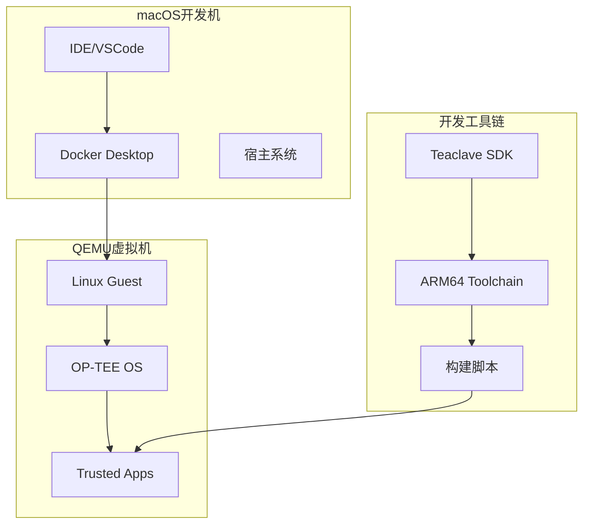
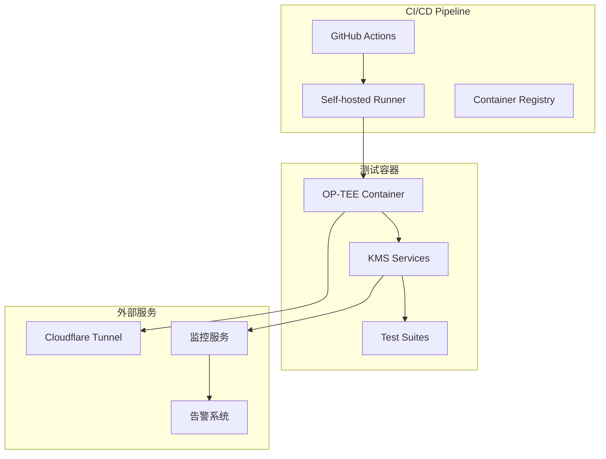
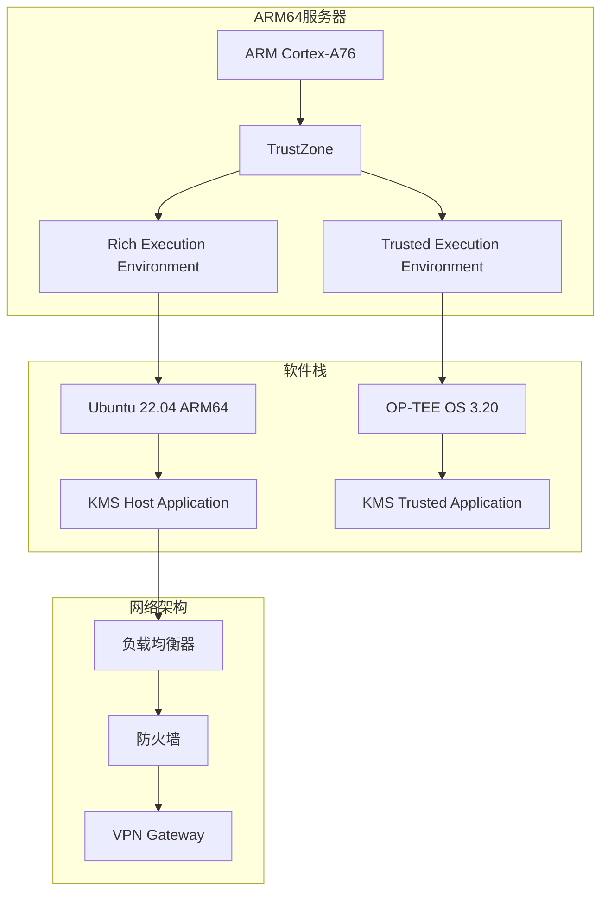
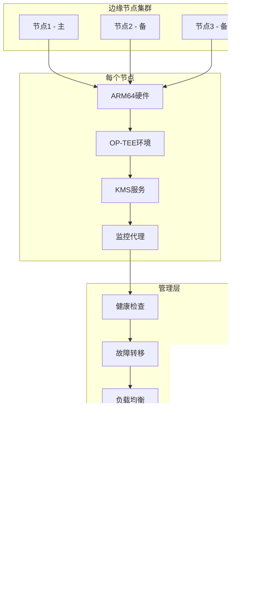

# TEE 部署架构设计文档
# TEE Deployment Architecture Design

*文档创建时间: 2025-09-28 12:03:15*

## 🎯 部署架构概述

设计从开发环境到生产环境的完整TEE部署架构，支持QEMU开发、ARM64硬件部署和混合云环境。

## 🏗️ 部署环境层次

### 1. 开发环境 (Development Environment)

**QEMU OP-TEE 模拟环境**



**配置规范:**
- **宿主系统**: macOS (M1/M2) 或 x86_64
- **虚拟化**: QEMU 7.0+ with ARM64 emulation
- **内存配置**: 2GB RAM, 10GB 存储
- **网络**: NAT模式，端口转发8080
- **OP-TEE版本**: 3.20.0 (LTS)

**目录结构:**
```
/opt/optee/
├── build/                  # 构建输出目录
├── qemu_v8/               # QEMU ARMv8 配置
├── toolchains/            # 交叉编译工具链
├── out-br/                # Buildroot 输出
└── kms-ta/                # KMS Trusted Application
```

### 2. 测试环境 (Testing Environment)

**容器化OP-TEE环境**



**Docker配置:**
```dockerfile
FROM ubuntu:22.04

# OP-TEE 依赖
RUN apt-get update && apt-get install -y \
    build-essential gcc-aarch64-linux-gnu \
    qemu-system-arm qemu-user-static \
    python3 python3-pip git

# Teaclave SDK
COPY third_party/incubator-teaclave-trustzone-sdk /opt/teaclave

# KMS 应用
COPY kms/ /opt/kms

# 启动脚本
COPY scripts/docker-entrypoint.sh /entrypoint.sh
ENTRYPOINT ["/entrypoint.sh"]
```

### 3. 预生产环境 (Staging Environment)

**ARM64物理服务器**



**硬件要求:**
- **CPU**: ARM Cortex-A76 (4核心+)
- **内存**: 8GB+ DDR4
- **存储**: 128GB+ NVMe SSD
- **网络**: 千兆以太网
- **安全**: TPM 2.0模块

### 4. 生产环境 (Production Environment)

**多节点高可用架构**



## 🔧 部署配置详细说明

### QEMU OP-TEE 开发环境

**启动配置文件** (`optee-qemu.yaml`):
```yaml
qemu:
  architecture: aarch64
  machine: virt
  cpu: cortex-a57
  memory: 2048MB

network:
  mode: user
  host_port: 8080
  guest_port: 8080

optee:
  version: "3.20.0"
  ta_storage: "/data/secure_storage"
  log_level: 1  # INFO级别

kms:
  config_file: "/etc/kms/config.toml"
  log_file: "/var/log/kms/service.log"
  pid_file: "/var/run/kms.pid"
```

**自动化构建脚本** (`scripts/build-qemu-optee.sh`):
```bash
#!/bin/bash

set -e

OPTEE_DIR="/opt/optee"
KMS_DIR="$(pwd)/kms"

# 1. 构建OP-TEE环境
cd $OPTEE_DIR
make -f qemu_v8.mk toolchains -j$(nproc)
make -f qemu_v8.mk all -j$(nproc)

# 2. 构建KMS TA
cd $KMS_DIR/kms-ta
make CROSS_COMPILE=aarch64-linux-gnu- \
     TA_DEV_KIT_DIR=$OPTEE_DIR/out-br/build/optee_examples-1.0/ta/include \
     O=$OPTEE_DIR/out

# 3. 构建KMS Host
cd $KMS_DIR/kms-host
cargo build --target aarch64-unknown-linux-gnu --release

# 4. 启动QEMU环境
cd $OPTEE_DIR
make -f qemu_v8.mk run-only CFG_TEE_CORE_LOG_LEVEL=1
```

### ARM64物理硬件部署

**系统配置** (`/etc/optee/optee.conf`):
```ini
[global]
log_level = 1
ta_store_path = /lib/optee_armtz
supp_log_level = 1

[ta_load]
ta_timeout = 30000
ta_max_instances = 16

[storage]
secure_storage_path = /data/tee
rpmb_key_provisioned = true

[kms]
config_file = /etc/kms/production.toml
log_level = info
max_keys = 10000
session_timeout = 300
```

**KMS服务配置** (`/etc/kms/production.toml`):
```toml
[server]
listen_addr = "0.0.0.0:8080"
read_timeout = "30s"
write_timeout = "30s"
max_connections = 1000

[tee]
ta_uuid = "bc50d971-d4c9-42c4-82cb-343fb7f37896"
session_timeout = "5m"
retry_count = 3

[security]
rate_limit = 100  # req/sec
max_key_operations_per_minute = 1000
require_tls = true
allowed_algorithms = ["ECDSA_SHA_256"]

[monitoring]
metrics_addr = "127.0.0.1:9090"
health_check_interval = "30s"
log_format = "json"

[storage]
backup_interval = "1h"
retention_days = 30
compression = true
```

### 高可用生产部署

**Kubernetes配置** (`k8s-kms-deployment.yaml`):
```yaml
apiVersion: apps/v1
kind: Deployment
metadata:
  name: kms-service
  namespace: kms-production
spec:
  replicas: 3
  selector:
    matchLabels:
      app: kms-service
  template:
    metadata:
      labels:
        app: kms-service
    spec:
      nodeSelector:
        hardware.type: "arm64-tee"
      containers:
      - name: kms-api
        image: kms:production-arm64
        ports:
        - containerPort: 8080
        resources:
          requests:
            memory: "512Mi"
            cpu: "500m"
          limits:
            memory: "1Gi"
            cpu: "1000m"
        livenessProbe:
          httpGet:
            path: /health
            port: 8080
          initialDelaySeconds: 30
          periodSeconds: 10
        readinessProbe:
          httpGet:
            path: /health
            port: 8080
          initialDelaySeconds: 5
          periodSeconds: 5
        volumeMounts:
        - name: tee-device
          mountPath: /dev/tee0
        - name: secure-storage
          mountPath: /data/tee
        - name: config-volume
          mountPath: /etc/kms
      volumes:
      - name: tee-device
        hostPath:
          path: /dev/tee0
      - name: secure-storage
        persistentVolumeClaim:
          claimName: kms-secure-storage
      - name: config-volume
        configMap:
          name: kms-config
```

## 📊 性能和扩展性配置

### 性能调优参数

**OP-TEE内核参数**:
```bash
# /etc/sysctl.d/99-optee.conf
# TEE内存池大小
optee.tee_shm_pool_size = 16777216  # 16MB

# 最大并发会话数
optee.max_sessions = 64

# TA加载超时时间
optee.ta_load_timeout = 30000  # 30秒
```

**KMS应用参数**:
```toml
[performance]
# 连接池配置
max_idle_connections = 50
max_open_connections = 200
connection_lifetime = "1h"

# 缓存配置
public_key_cache_size = 1000
cache_ttl = "1h"
enable_cache_compression = true

# 并发控制
max_concurrent_operations = 100
operation_timeout = "30s"
batch_operation_size = 10
```

### 监控和告警配置

**Prometheus监控**:
```yaml
# prometheus.yml
global:
  scrape_interval: 15s

scrape_configs:
- job_name: 'kms-metrics'
  static_configs:
  - targets: ['localhost:9090']
  metrics_path: /metrics
  scrape_interval: 5s

rule_files:
- "kms-alerts.yml"

alerting:
  alertmanagers:
  - static_configs:
    - targets:
      - alertmanager:9093
```

**告警规则** (`kms-alerts.yml`):
```yaml
groups:
- name: kms.rules
  rules:
  - alert: KMSHighLatency
    expr: histogram_quantile(0.95, kms_request_duration_seconds) > 0.1
    for: 5m
    labels:
      severity: warning
    annotations:
      summary: "KMS API延迟过高"

  - alert: KMSTEEError
    expr: increase(kms_tee_errors_total[5m]) > 10
    for: 2m
    labels:
      severity: critical
    annotations:
      summary: "TEE通信错误率过高"

  - alert: KMSServiceDown
    expr: up{job="kms-metrics"} == 0
    for: 1m
    labels:
      severity: critical
    annotations:
      summary: "KMS服务不可用"
```

## 🚀 自动化部署流程

### CI/CD Pipeline

```yaml
# .github/workflows/deploy-tee.yml
name: Deploy TEE Environment

on:
  push:
    branches: [main, staging]
  pull_request:
    branches: [main]

jobs:
  build-and-test:
    runs-on: [self-hosted, arm64]
    steps:
    - uses: actions/checkout@v3
      with:
        submodules: recursive

    - name: Setup OP-TEE Environment
      run: |
        scripts/setup-optee-ci.sh

    - name: Build KMS TA
      run: |
        cd kms/kms-ta
        make clean && make all

    - name: Run TEE Tests
      run: |
        scripts/test-optee-integration.sh

    - name: Security Scan
      run: |
        scripts/security-scan.sh

    - name: Deploy to Staging
      if: github.ref == 'refs/heads/staging'
      run: |
        scripts/deploy-staging.sh

    - name: Deploy to Production
      if: github.ref == 'refs/heads/main'
      run: |
        scripts/deploy-production.sh
```

### 部署脚本

**一键部署脚本** (`scripts/deploy-production.sh`):
```bash
#!/bin/bash

set -e

ENVIRONMENT="${1:-production}"
CONFIG_DIR="/etc/kms"
SERVICE_USER="kms"

echo "🚀 开始部署KMS TEE环境到 $ENVIRONMENT"

# 1. 停止现有服务
sudo systemctl stop kms-api || true

# 2. 备份配置和数据
sudo cp -r $CONFIG_DIR $CONFIG_DIR.backup.$(date +%s)
sudo cp -r /data/tee /data/tee.backup.$(date +%s)

# 3. 安装新版本
sudo cp target/aarch64-unknown-linux-gnu/release/kms-api /usr/local/bin/
sudo cp target/aarch64-unknown-optee/release/*.ta /lib/optee_armtz/

# 4. 更新配置
sudo cp configs/$ENVIRONMENT.toml $CONFIG_DIR/config.toml
sudo chown -R $SERVICE_USER:$SERVICE_USER $CONFIG_DIR

# 5. 启动服务
sudo systemctl start kms-api
sudo systemctl enable kms-api

# 6. 健康检查
for i in {1..30}; do
    if curl -f http://localhost:8080/health; then
        echo "✅ 服务启动成功"
        break
    fi
    sleep 2
done

# 7. 运行验证测试
python3 scripts/test-kms-apis.py --production

echo "🎉 部署完成！"
```

## 🔒 安全和合规配置

### 访问控制

**系统级权限**:
```bash
# 创建专用用户
sudo useradd -r -s /bin/false -d /var/lib/kms kms

# 设置文件权限
sudo chown -R kms:kms /var/lib/kms
sudo chmod 700 /var/lib/kms
sudo chmod 600 /etc/kms/config.toml

# SELinux/AppArmor策略
sudo setsebool -P tee_access on
```

**网络安全**:
```bash
# 防火墙规则
sudo ufw allow from 10.0.0.0/8 to any port 8080
sudo ufw allow from 172.16.0.0/12 to any port 8080
sudo ufw deny 8080

# TLS配置
openssl genpkey -algorithm RSA -out /etc/kms/server.key -pkcs8
openssl req -new -x509 -key /etc/kms/server.key -out /etc/kms/server.crt -days 365
```

### 数据保护

**备份策略**:
```bash
#!/bin/bash
# /etc/cron.hourly/kms-backup

BACKUP_DIR="/backup/kms/$(date +%Y%m%d)"
mkdir -p $BACKUP_DIR

# 备份TEE存储
sudo cp -r /data/tee $BACKUP_DIR/
sudo tar -czf $BACKUP_DIR/secure_storage.tar.gz -C /data tee

# 备份配置
sudo cp -r /etc/kms $BACKUP_DIR/

# 清理旧备份（保留30天）
find /backup/kms -type d -mtime +30 -exec rm -rf {} +
```

**审计日志**:
```bash
# /etc/rsyslog.d/50-kms.conf
if $programname == 'kms-api' then /var/log/kms/audit.log
& stop
```

## 📈 容量规划和扩展

### 资源需求评估

**单节点配置**:
- **CPU**: 4核心 (支持1000+ TPS)
- **内存**: 8GB (支持10000+密钥)
- **存储**: 128GB NVMe (20年数据保留)
- **网络**: 1Gbps (支持全球访问)

**扩展阈值**:
- CPU使用率 > 70% → 增加节点
- 内存使用率 > 80% → 增加内存
- 磁盘使用率 > 85% → 扩展存储
- 网络带宽 > 500Mbps → 增加带宽

### 水平扩展方案

**多区域部署**:
```
Region 1 (主): 北美东部
├── 节点1: 主服务
├── 节点2: 热备份
└── 节点3: 负载分担

Region 2 (备): 欧洲西部
├── 节点4: 灾难恢复
└── 节点5: 就近访问

Region 3 (辅): 亚太地区
├── 节点6: 就近访问
└── 节点7: 负载分担
```

## 🎯 部署检查清单

### 环境验证
- [ ] ARM64硬件兼容性确认
- [ ] OP-TEE OS版本验证
- [ ] Teaclave SDK编译测试
- [ ] 网络连接和端口检查

### 安全检查
- [ ] TEE安全启动验证
- [ ] 密钥存储加密确认
- [ ] 网络通信TLS配置
- [ ] 访问控制权限设置

### 功能验证
- [ ] KMS API全功能测试
- [ ] 性能基准测试通过
- [ ] 故障恢复机制验证
- [ ] 监控告警测试

### 运维准备
- [ ] 日志收集和分析配置
- [ ] 备份恢复流程验证
- [ ] 应急响应手册准备
- [ ] 运维团队培训完成

---

**这个部署架构确保KMS系统能够在从开发到生产的所有环境中稳定运行，同时满足企业级的安全、性能和可用性要求。**