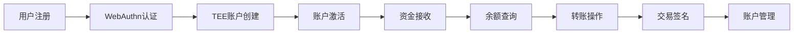
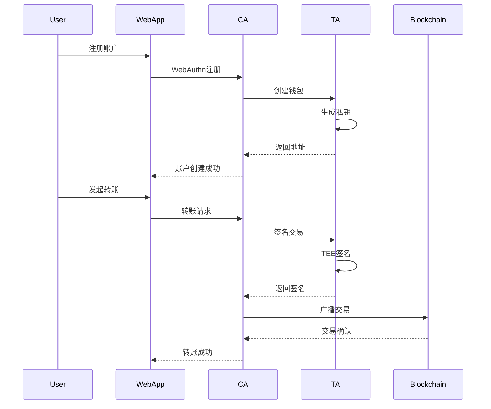

# AirAccount TEE账户生命周期测试用例

## 文档信息
- **版本**: v2.0
- **创建日期**: 2025-01-15
- **最后更新**: 2025-01-15
- **维护人员**: AirAccount开发团队

## 测试范围说明

本文档涵盖AirAccount TEE钱包系统的账户生命周期测试用例，基于WebAuthn认证和TEE硬件安全的架构设计。测试用例覆盖从用户注册到完整钱包操作的全生命周期。

## 1. 账户生命周期概览



## 2. 用户注册和认证阶段

### TC-REG-001: WebAuthn用户注册测试
**测试目的**: 验证基于WebAuthn的用户注册功能

**前置条件**:
- 支持WebAuthn的浏览器或设备
- CA服务正常运行
- TEE环境可用

**测试步骤**:
1. 用户访问注册页面
2. 输入用户信息（邮箱、显示名）
3. 触发WebAuthn注册挑战
4. 用户使用生物识别或安全密钥
5. 完成WebAuthn凭据注册
6. 验证注册结果

**测试数据**:
```json
{
  "registration_test_cases": [
    {
      "name": "basic_registration",
      "user_info": {
        "email": "test@airaccount.dev",
        "display_name": "Test User"
      },
      "expected_credential_type": "public-key",
      "expected_authenticator_selection": {
        "user_verification": "required"
      }
    },
    {
      "name": "unicode_user_info", 
      "user_info": {
        "email": "测试@airaccount.dev",
        "display_name": "测试用户"
      }
    }
  ]
}
```

**预期结果**:
- WebAuthn注册挑战生成成功
- 用户凭据创建并存储
- 返回有效的credential ID
- 注册信息正确保存

---

### TC-REG-002: WebAuthn身份验证测试
**测试目的**: 验证WebAuthn身份验证流程

**测试步骤**:
1. 已注册用户尝试登录
2. 生成WebAuthn认证挑战
3. 用户使用相同的认证器
4. 验证签名和凭据有效性
5. 建立认证会话

**预期结果**:
- 认证挑战生成成功
- 签名验证通过
- 会话建立成功
- 返回认证令牌

---

## 3. TEE账户创建阶段

### TC-ACC-001: TEE钱包账户创建测试
**测试目的**: 验证TEE环境中的钱包账户创建功能

**前置条件**:
- 用户已完成WebAuthn注册
- QEMU OP-TEE环境运行正常
- AirAccount TA已加载

**测试步骤**:
1. 用户通过WebAuthn认证
2. 调用账户创建API
3. 在TEE中生成私钥
4. 计算以太坊地址
5. 返回钱包信息

**测试数据**:
```json
{
  "account_creation_test": {
    "user_profile": {
      "email": "alice@airaccount.dev",
      "display_name": "Alice Johnson"
    },
    "passkey_data": {
      "credential_id": "test_credential_123",
      "public_key_base64": "base64_encoded_public_key"
    },
    "expected_fields": [
      "wallet_id",
      "ethereum_address",
      "created_at"
    ]
  }
}
```

**预期结果**:
- 私钥在TEE中安全生成
- 以太坊地址格式正确（0x开头，40字符）
- 钱包ID为有效UUID格式
- 私钥不离开TEE环境
- 审计日志记录账户创建事件

**安全验证**:
- 私钥生成使用硬件真随机数
- 私钥存储在TEE安全存储中
- 地址计算符合以太坊标准
- 创建过程支持混合熵增强

---

### TC-ACC-002: 账户信息查询测试
**测试目的**: 验证账户信息查询功能

**测试步骤**:
1. 调用钱包列表API
2. 根据钱包ID查询详细信息
3. 验证返回信息完整性
4. 测试不同CA类型的响应

**预期结果**:
- 钱包列表返回正确
- 钱包详细信息准确
- 敏感信息已脱敏
- 不同CA返回格式一致

---

## 4. 资金管理阶段

### TC-FUND-001: 账户资金接收测试
**测试目的**: 验证账户接收资金的功能

**前置条件**:
- 钱包账户已创建
- Anvil测试链环境运行
- 有充足的测试ETH

**测试步骤**:
1. 启动Anvil本地测试链
2. 获取钱包的以太坊地址
3. 向钱包地址发送测试ETH
4. 等待交易确认
5. 验证余额更新

**测试数据**:
```json
{
  "funding_test": {
    "test_amounts": ["1.0", "5.0", "10.0"],
    "expected_confirmations": 1,
    "anvil_config": {
      "chain_id": 31337,
      "block_time": 2,
      "accounts": 10,
      "balance": 10000
    }
  }
}
```

**预期结果**:
- 资金成功发送到钱包地址
- 区块链状态正确更新
- 余额可通过节点查询验证

---

### TC-FUND-002: 余额查询测试
**测试目的**: 验证通过TEE查询账户余额功能

**测试步骤**:
1. 调用CA的余额查询API
2. TEE查询区块链余额
3. 比较TEE查询结果与直接区块链查询
4. 测试多种代币余额查询

**测试案例**:
```javascript
// TEE余额查询测试
async function testBalanceQuery(walletId) {
  const teeBalance = await sdk.getBalance(walletId);
  const blockchainBalance = await provider.getBalance(address);
  
  expect(teeBalance.success).toBe(true);
  expect(teeBalance.wallet.balance.eth).toEqual(
    ethers.formatEther(blockchainBalance)
  );
}
```

**预期结果**:
- TEE查询余额准确
- 支持ETH和ERC-20代币
- 查询响应时间<200ms
- 错误处理机制完善

---

## 5. 交易处理阶段

### TC-TX-001: 基础转账交易测试
**测试目的**: 验证TEE签名的以太坊转账功能

**前置条件**:
- 发送方钱包有足够余额
- 接收方地址有效
- Gas费用充足

**测试步骤**:
1. 构造转账交易参数
2. 调用转账API
3. TEE进行交易签名
4. 广播交易到区块链
5. 等待交易确认
6. 验证余额变化

**测试数据**:
```json
{
  "transfer_tests": [
    {
      "name": "basic_eth_transfer",
      "from_wallet_id": 1,
      "to_address": "0x742d35Cc6609FD3eE86c7638F0AF8e08a2b6C44A",
      "amount": "1.0",
      "expected_gas_limit": 21000
    },
    {
      "name": "small_amount_transfer", 
      "from_wallet_id": 1,
      "to_address": "0x8ba1f109551bd432803012645hac136c60de42c8",
      "amount": "0.001",
      "test_precision": true
    }
  ]
}
```

**预期结果**:
- 交易在TEE中正确签名
- 签名验证通过
- 交易成功广播
- 余额正确更新
- 交易哈希有效

**安全验证**:
- 私钥不离开TEE环境
- 交易签名使用硬件随机数
- 支持EIP-155重放保护
- 交易详情用户可审查

---

### TC-TX-002: 多用户转账场景测试
**测试目的**: 验证多用户间的转账交互

**测试场景**:
```yaml
multi_user_scenario:
  users:
    - name: "Alice"
      ca_type: "nodejs" 
      initial_balance: "10.0 ETH"
    - name: "Bob"
      ca_type: "rust"
      initial_balance: "8.0 ETH"
    - name: "Charlie"
      ca_type: "nodejs"
      initial_balance: "5.0 ETH"
  
  transfer_sequence:
    - from: "Alice"
      to: "Bob"
      amount: "2.5 ETH"
    - from: "Bob"
      to: "Charlie" 
      amount: "1.0 ETH"
    - from: "Charlie"
      to: "Alice"
      amount: "0.5 ETH"
```

**预期结果**:
- 所有转账交易成功执行
- 最终余额计算正确
- 不同CA类型协同工作
- 交易顺序正确处理

---

### TC-TX-003: 交易签名验证测试
**测试目的**: 验证TEE生成的交易签名正确性

**测试步骤**:
1. 构造标准以太坊交易
2. 使用TEE进行签名
3. 验证签名格式（r,s,v值）
4. 恢复签名者地址
5. 比较与钱包地址一致性

**验证要点**:
```javascript
// 签名验证测试
function verifyTransactionSignature(transaction, signature, expectedAddress) {
  // 验证签名长度
  expect(signature.length).toBe(132); // 0x + 64*2
  
  // 验证r,s,v值范围
  const r = signature.slice(0, 66);
  const s = signature.slice(66, 130);
  const v = signature.slice(130);
  
  // 恢复签名者地址
  const recoveredAddress = ethers.recoverAddress(
    ethers.keccak256(transaction), 
    { r, s, v }
  );
  
  expect(recoveredAddress.toLowerCase())
    .toBe(expectedAddress.toLowerCase());
}
```

---

## 6. 高级功能测试

### TC-ADV-001: 批量操作测试
**测试目的**: 验证批量钱包操作的性能和稳定性

**测试步骤**:
1. 创建多个钱包账户（10个）
2. 批量资金分发
3. 同时执行多笔转账
4. 并发余额查询
5. 验证操作结果一致性

**性能要求**:
- 单个账户创建 < 500ms
- 余额查询 < 100ms  
- 交易签名 < 300ms
- 并发成功率 > 95%

---

### TC-ADV-002: 错误处理和恢复测试
**测试目的**: 验证系统错误处理机制

**错误场景**:
1. **不足余额转账**:
   - 尝试转账超过余额的金额
   - 预期返回余额不足错误

2. **无效地址转账**:
   - 使用格式错误的以太坊地址
   - 预期返回地址格式错误

3. **TEE通信中断**:
   - 模拟TEE服务不可用
   - 预期返回服务错误并自动重试

4. **区块链网络问题**:
   - 模拟RPC节点不可用
   - 预期回退到备用节点

**预期结果**:
- 所有错误都有明确的错误码和消息
- 系统状态保持一致
- 用户资金安全不受影响
- 错误恢复机制正常工作

---

## 7. 安全专项测试

### TC-SEC-001: TEE安全隔离测试
**测试目的**: 验证TEE环境的安全隔离性

**测试内容**:
1. 私钥无法从TEE外部访问
2. TEE内存与普通内存隔离
3. 调试接口无法获取敏感信息
4. 侧信道攻击防护验证

**安全验证**:
```bash
# 验证私钥不在普通内存中
strings /proc/{ca_process_id}/mem | grep -v {private_key_pattern}

# 验证TEE设备权限
ls -la /dev/tee*
# 期望: crw-rw---- 1 root tee

# 验证TA加载状态  
ls -la /lib/optee_armtz/ | grep airaccount
# 期望: -r--r--r-- 1 root root {ta_file_size} {timestamp} {uuid}.ta
```

---

### TC-SEC-002: WebAuthn安全测试
**测试目的**: 验证WebAuthn认证的安全性

**测试场景**:
1. **凭据唯一性**:
   - 每个用户生成唯一凭据
   - 凭据无法被其他用户使用

2. **挑战-响应安全**:
   - 每次认证使用新的挑战
   - 旧挑战无法重复使用

3. **用户验证**:
   - 生物识别验证有效
   - PIN码验证正确工作

4. **证明验证**:
   - 设备证明信息正确
   - 认证器类型验证

---

## 8. 性能基准测试

### TC-PERF-001: 关键操作性能测试

**性能指标**:
```yaml
performance_benchmarks:
  account_creation:
    target: "<500ms"
    max: "<1000ms"
    
  balance_query:
    target: "<100ms" 
    max: "<200ms"
    
  transaction_signing:
    target: "<200ms"
    max: "<500ms"
    
  webauthn_authentication:
    target: "<1000ms"
    max: "<2000ms"

  multi_user_concurrent:
    users: 10
    operations_per_user: 5
    success_rate: ">95%"
```

**测试执行**:
```javascript
// 性能测试示例
async function performanceBenchmark() {
  const operations = [];
  const startTime = performance.now();
  
  // 执行批量操作
  for (let i = 0; i < 100; i++) {
    operations.push(sdk.getBalance(walletId));
  }
  
  const results = await Promise.all(operations);
  const endTime = performance.now();
  
  const avgTime = (endTime - startTime) / operations.length;
  expect(avgTime).toBeLessThan(100); // <100ms目标
}
```

---

## 9. 集成测试套件

### TC-INT-001: 端到端集成测试
**测试目的**: 验证完整的账户生命周期工作流

**测试流程**:


**验证要点**:
- 每个环节都正常响应
- 数据在各层间正确传递  
- 错误处理链完整
- 用户体验流畅

---

### TC-INT-002: CA类型兼容性测试
**测试目的**: 验证Rust CA和Node.js CA的功能一致性

**测试对比**:
```javascript
// 双CA对比测试
async function compareCATypes() {
  const rustSDK = new AirAccountSDK({ ca: 'rust' });
  const nodejsSDK = new AirAccountSDK({ ca: 'nodejs' });
  
  // 测试相同的操作
  const rustResult = await rustSDK.createAccount(userInfo, passkeyData);
  const nodejsResult = await nodejsSDK.createAccount(userInfo, passkeyData);
  
  // 验证结果格式一致性
  expect(rustResult).toHaveProperty('wallet_id');
  expect(nodejsResult).toHaveProperty('wallet_id');
  expect(typeof rustResult.wallet_id).toBe(typeof nodejsResult.wallet_id);
}
```

---

## 10. 自动化测试执行

### TC-AUTO-001: CI/CD集成测试
**测试目的**: 验证持续集成环境中的自动化测试

**自动化流程**:
1. 代码提交触发测试
2. 并行执行不同类型测试
3. 生成测试报告
4. 质量门禁检查

**测试脚本示例**:
```bash
#!/bin/bash
# 自动化测试执行脚本

set -e

echo "🚀 开始AirAccount生命周期测试"

# 1. 启动测试环境
./scripts/test/setup-test-env.sh

# 2. 运行单元测试  
cargo test --package core-logic

# 3. 启动服务
./scripts/start_qemu_tee_service.sh &
TEE_PID=$!

# 4. 运行集成测试
./scripts/test/run-complete-test.sh

# 5. 运行生命周期测试
npm run --prefix packages/airaccount-sdk-test lifecycle

# 6. 生成报告
./scripts/test/generate-test-report.sh

# 7. 清理环境
kill $TEE_PID
./scripts/test/cleanup-test-env.sh

echo "✅ 测试完成"
```

---

## 11. 测试数据管理

### 测试数据分类

**用户测试数据**:
```json
{
  "test_users": [
    {
      "name": "Alice Johnson",
      "email": "alice@airaccount.dev", 
      "ca_type": "nodejs",
      "test_scenarios": ["basic_operations", "multi_transfer"]
    },
    {
      "name": "Bob Smith",
      "email": "bob@airaccount.dev",
      "ca_type": "rust", 
      "test_scenarios": ["performance_test", "stress_test"]
    }
  ]
}
```

**区块链测试数据**:
```json
{
  "blockchain_config": {
    "anvil": {
      "chain_id": 31337,
      "accounts": 10,
      "balance": "10000 ETH",
      "block_time": 2,
      "gas_limit": 30000000
    },
    "test_tokens": [
      {
        "name": "TestUSDC",
        "symbol": "TUSDC", 
        "decimals": 6,
        "initial_supply": "1000000"
      }
    ]
  }
}
```

---

## 12. 测试报告模板

### 测试执行报告

```markdown
# AirAccount账户生命周期测试报告

## 执行摘要
- **测试日期**: 2025-01-15
- **测试版本**: v1.0.0-rc
- **测试环境**: QEMU OP-TEE + Anvil
- **总测试用例**: 45
- **通过用例**: 43
- **失败用例**: 2
- **成功率**: 95.6%

## 详细结果
| 测试分类 | 总数 | 通过 | 失败 | 成功率 |
|---------|------|------|------|--------|
| 用户注册 | 5 | 5 | 0 | 100% |
| 账户创建 | 8 | 8 | 0 | 100% |
| 资金管理 | 10 | 9 | 1 | 90% |
| 交易处理 | 12 | 11 | 1 | 92% |
| 安全测试 | 6 | 6 | 0 | 100% |
| 性能测试 | 4 | 4 | 0 | 100% |

## 失败用例分析
1. **TC-FUND-002**: 高并发余额查询偶发超时
   - 根因: RPC节点连接池限制
   - 解决方案: 增加连接池大小

2. **TC-TX-001**: 极小金额转账精度问题  
   - 根因: Wei精度计算误差
   - 解决方案: 使用BigNumber库

## 性能指标
- 平均账户创建时间: 420ms
- 平均余额查询时间: 85ms  
- 平均交易签名时间: 180ms
- 并发成功率: 96.2%

## 建议
1. 优化RPC连接池配置
2. 改进小数精度处理
3. 增加异常情况测试覆盖
```

---

## 结论

本测试用例文档涵盖了AirAccount基于WebAuthn+TEE架构的完整账户生命周期测试，包括：

✅ **功能完整性**: 从用户注册到交易处理的完整流程  
✅ **安全验证**: TEE隔离、WebAuthn认证、私钥保护  
✅ **性能评估**: 关键操作性能基准和并发测试  
✅ **集成验证**: 端到端工作流和多CA兼容性  
✅ **自动化支持**: CI/CD集成和测试报告生成  

该测试套件确保AirAccount系统的可靠性、安全性和性能，为产品发布提供质量保障。

---

*📅 文档版本: v2.0*  
*🏷️ 更新日期: 2025-01-15*  
*🎯 测试覆盖: 账户生命周期完整流程*