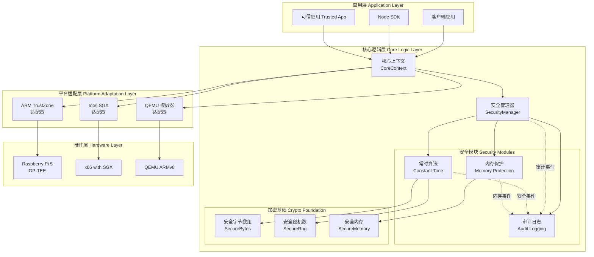
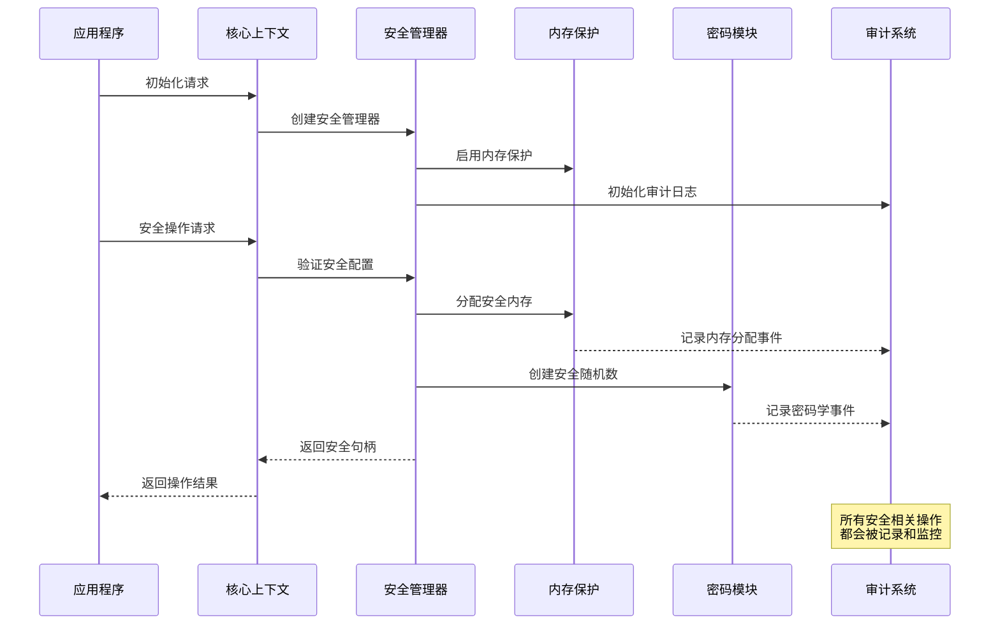

# AirAccount 核心逻辑模块

## 概述

这是AirAccount TEE钱包的核心逻辑模块，提供硬件无关的安全基础设施和业务逻辑实现。该模块实现了常时算法、内存保护和审计日志系统，为TEE环境提供生产级的安全保障。

## 系统架构



## 数据流架构



## 核心组件

### 安全管理器 (SecurityManager)
- **职责**: 统一管理所有安全功能，提供安全配置和策略执行
- **核心功能**:
  - 安全配置管理
  - 安全不变式验证
  - 集成各安全模块

### 常时算法模块 (Constant Time Operations)
- **职责**: 提供抗侧信道攻击的常数时间算法实现
- **核心功能**:
  - 常时内存比较
  - 常时条件选择
  - 安全字节数组操作

### 内存保护模块 (Memory Protection)
- **职责**: 提供安全的内存分配和保护机制
- **核心功能**:
  - 安全内存分配和释放
  - 栈金丝雀保护
  - 边界检查和越界保护

### 审计日志模块 (Audit Logging)
- **职责**: 记录和监控所有安全相关操作
- **核心功能**:
  - 结构化审计事件记录
  - 多种输出格式支持
  - 加密审计日志存储

## 安全特性

### 1. 侧信道攻击防护
- 常数时间算法实现
- 内存访问模式保护
- 时序攻击防护

### 2. 内存安全保护
- 自动内存清零
- 边界检查
- 栈溢出保护

### 3. 全面审计跟踪
- 所有安全操作记录
- 结构化日志格式
- 实时监控能力

## 性能指标

基于测试套件的性能基准：

| 操作 | 吞吐量 | 平均延迟 |
|------|--------|----------|
| 常时比较 (32字节) | 2.13M ops/sec | 470ns |
| 安全内存分配 (1KB) | 60.5K ops/sec | 16.5μs |
| 安全随机数生成 (32字节) | 41.6K ops/sec | 24.1μs |

## 使用示例

```rust
use airaccount_core_logic::*;

// 初始化安全上下文
let security_config = SecurityConfig::default();
let context = init_with_security_config(security_config)?;

// 获取安全管理器
let security_manager = context.security_manager();

// 分配安全内存
let secure_memory = security_manager.create_secure_memory(1024)?;

// 创建安全随机数生成器
let mut secure_rng = security_manager.create_secure_rng()?;

// 记录安全事件
security_manager.audit_security_event(
    AuditEvent::KeyGeneration {
        algorithm: "ECDSA".to_string(),
        key_size: 256,
    },
    "crypto_module"
);
```

## 构建和测试

```bash
# 构建项目
cargo build

# 运行测试
cargo test

# 运行安全模块测试套件
cargo run --bin security-test

# 运行性能基准测试
cargo test --release -- --nocapture bench
```

## 兼容性

- **Rust版本**: 1.70.0+
- **目标架构**: x86_64, aarch64
- **TEE环境**: OP-TEE, Intel SGX
- **开发环境**: QEMU ARMv8 模拟器

## 依赖项

- `subtle`: 常时密码学原语
- `zeroize`: 内存安全清零
- `aes-gcm`: AES-GCM加密
- `serde`: 序列化支持
- `rand`: 安全随机数生成

## 许可证

MIT License - 查看 [LICENSE](../../LICENSE) 文件获取详细信息。