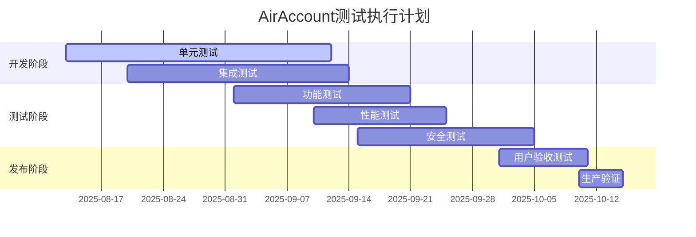

# AirAccount TEE钱包系统测试用例文档

## 文档信息
- **版本**: v1.0
- **创建日期**: 2025-08-13
- **最后更新**: 2025-08-13
- **维护人员**: AirAccount测试团队

## 测试范围说明

本文档涵盖AirAccount TEE钱包系统的完整测试用例，包括功能测试、性能测试、安全测试、集成测试等各个方面。测试用例基于项目的技术架构和业务需求设计。

## 1. 钱包核心功能测试

### 1.1 钱包生命周期管理

#### TC-WM-001: 钱包创建功能测试
**测试目的**: 验证钱包创建功能的正确性和安全性

**前置条件**:
- TEE环境已初始化
- 系统具备足够的熵源
- 核心逻辑模块已加载

**测试步骤**:
1. 调用钱包创建接口，使用默认参数
2. 验证返回的钱包ID格式正确
3. 验证私钥已安全存储在TEE中
4. 验证助记词生成符合BIP39标准
5. 验证钱包地址计算正确

**预期结果**:
- 钱包创建成功，返回有效的UUID
- 生成12词助记词，词汇来自BIP39标准词表
- 地址格式符合以太坊标准（0x开头，40字符十六进制）
- 审计日志记录钱包创建事件

**测试数据**:
```json
{
  "test_cases": [
    {
      "name": "default_creation",
      "params": {
        "password": "TestPassword123!",
        "wallet_name": "test_wallet_001"
      },
      "expected_mnemonic_length": 12
    },
    {
      "name": "custom_mnemonic",
      "params": {
        "mnemonic": "abandon abandon abandon abandon abandon abandon abandon abandon abandon abandon abandon about",
        "password": "CustomPassword456!",
        "wallet_name": "test_wallet_002"
      },
      "expected_address": "0x9858EfFD232B4033E47d90003D41EC34EcaEda94"
    }
  ]
}
```

---

#### TC-WM-002: 钱包激活功能测试
**测试目的**: 验证钱包激活和身份认证功能

**前置条件**:
- 已创建钱包
- 用户拥有正确的密码

**测试步骤**:
1. 使用正确密码激活钱包
2. 使用错误密码尝试激活钱包
3. 连续错误密码尝试激活钱包
4. 验证激活状态持久性

**预期结果**:
- 正确密码激活成功
- 错误密码激活失败，返回认证错误
- 连续错误尝试触发锁定机制
- 激活状态在会话期间保持

**边界测试**:
- 密码长度边界测试（最短8位，最长128位）
- 特殊字符密码测试
- Unicode字符密码测试

---

#### TC-WM-003: 钱包锁定/解锁功能测试
**测试目的**: 验证钱包安全锁定机制

**测试步骤**:
1. 激活钱包后立即锁定
2. 使用正确密码解锁
3. 测试自动锁定功能（超时）
4. 测试强制锁定功能

**预期结果**:
- 锁定后无法执行敏感操作
- 正确密码可以解锁
- 超时自动锁定正常工作
- 强制锁定立即生效

---

### 1.2 密钥管理功能测试

#### TC-KM-001: 私钥派生功能测试
**测试目的**: 验证HD钱包私钥派生功能

**测试步骤**:
1. 使用标准BIP32路径派生私钥
2. 验证派生私钥的正确性
3. 测试不同深度的密钥派生
4. 验证派生密钥的一致性

**测试数据**:
```
HD路径测试用例:
- m/44'/60'/0'/0/0  (以太坊标准路径)
- m/44'/60'/0'/0/1  (第二个地址)
- m/44'/60'/1'/0/0  (第二个账户)
- m/0/1/2/3/4/5    (深度测试)
```

**预期结果**:
- 相同路径派生出相同私钥
- 不同路径派生出不同私钥
- 派生过程符合BIP32标准
- 私钥格式正确（32字节）

---

#### TC-KM-002: 公钥和地址生成测试
**测试目的**: 验证公钥计算和地址生成

**测试步骤**:
1. 从私钥计算公钥
2. 从公钥生成以太坊地址
3. 验证地址校验和
4. 测试压缩和非压缩公钥

**预期结果**:
- 公钥计算正确（65字节非压缩或33字节压缩）
- 地址生成符合以太坊标准
- 地址校验和正确
- 支持EIP-55大小写校验和

---

### 1.3 交易签名功能测试

#### TC-TS-001: 基础交易签名测试
**测试目的**: 验证以太坊交易签名功能

**前置条件**:
- 钱包已激活
- 私钥可用

**测试数据**:
```json
{
  "transactions": [
    {
      "name": "eth_transfer",
      "to": "0x742d35Cc6635C0532925a3b8D2020d4820b41e8",
      "value": "1000000000000000000",
      "gas_limit": 21000,
      "gas_price": "20000000000",
      "nonce": 0,
      "chain_id": 1,
      "data": ""
    },
    {
      "name": "token_transfer",
      "to": "0xA0b86a33E6417c24A2A85BFe2F1D5E95fb74b4c9",
      "value": "0",
      "gas_limit": 60000,
      "gas_price": "25000000000",
      "nonce": 1,
      "chain_id": 1,
      "data": "0xa9059cbb000000000000000000000000742d35cc6635c0532925a3b8d2020d4820b41e80000000000000000000000000000000000000000000000000de0b6b3a7640000"
    }
  ]
}
```

**测试步骤**:
1. 构造标准以太坊转账交易
2. 使用钱包签名交易
3. 验证签名格式（r, s, v值）
4. 验证签名可以恢复出正确的地址
5. 测试不同网络的chain_id

**预期结果**:
- 签名长度正确（65字节）
- 签名验证通过
- 恢复地址与钱包地址一致
- 不同chain_id产生不同签名

---

#### TC-TS-002: EIP-1559交易签名测试
**测试目的**: 验证EIP-1559交易类型支持

**测试数据**:
```json
{
  "eip1559_transaction": {
    "to": "0x742d35Cc6635C0532925a3b8D2020d4820b41e8",
    "value": "1000000000000000000",
    "gas_limit": 21000,
    "max_fee_per_gas": "30000000000",
    "max_priority_fee_per_gas": "2000000000",
    "nonce": 0,
    "chain_id": 1,
    "access_list": []
  }
}
```

**预期结果**:
- 支持EIP-1559交易格式
- 签名验证通过
- 交易哈希计算正确

---

## 2. 安全功能测试

### 2.1 内存保护测试

#### TC-SEC-001: 安全内存分配测试
**测试目的**: 验证安全内存管理机制

**测试步骤**:
1. 分配不同大小的安全内存
2. 验证内存清零功能
3. 测试内存边界检查
4. 验证内存自动清理

**测试用例**:
```rust
// 测试用例伪代码
fn test_secure_memory_allocation() {
    let sizes = vec![64, 256, 1024, 4096, 8192];
    for size in sizes {
        let memory = SecureMemory::new(size).expect("分配失败");
        assert_eq!(memory.size(), size);
        
        // 验证初始清零
        assert!(memory.as_slice().iter().all(|&b| b == 0));
        
        // 写入数据
        let test_data = vec![0xAA; size];
        memory.copy_from_slice(&test_data).expect("写入失败");
        
        // 验证数据正确
        assert_eq!(memory.as_slice(), &test_data);
    }
}
```

**预期结果**:
- 内存分配成功
- 初始状态为零
- 边界检查有效
- 释放时自动清零

---

#### TC-SEC-002: 常数时间操作测试
**测试目的**: 验证抗时序攻击的常数时间操作

**测试步骤**:
1. 测试常数时间比较函数
2. 测试条件选择函数
3. 进行时序测量验证
4. 测试不同数据长度

**预期结果**:
- 操作时间不依赖于数据内容
- 相同长度数据的操作时间一致
- 时序变化在统计上不显著

---

### 2.2 审计日志测试

#### TC-SEC-003: 审计日志功能测试
**测试目的**: 验证安全审计日志系统

**测试步骤**:
1. 执行各种钱包操作
2. 验证审计日志的完整性
3. 测试日志轮转功能
4. 验证日志加密功能

**预期日志事件**:
- 钱包创建/激活/锁定
- 密钥派生操作
- 交易签名操作
- 安全异常事件

**预期结果**:
- 所有关键操作都有日志记录
- 日志格式标准化
- 日志完整不可篡改
- 敏感信息被适当脱敏

---

## 3. 性能测试

### 3.1 基准性能测试

#### TC-PERF-001: 钱包操作性能基准
**测试目的**: 建立钱包操作的性能基准

**性能指标**:
```yaml
performance_requirements:
  wallet_creation:
    target: "<100ms"
    max_acceptable: "<500ms"
  
  transaction_signing:
    target: "<50ms"
    max_acceptable: "<200ms"
  
  key_derivation:
    target: "<10ms"
    max_acceptable: "<50ms"
  
  memory_allocation:
    target: "<1ms"
    max_acceptable: "<10ms"
```

**测试方法**:
1. 单次操作延迟测试
2. 批量操作吞吐量测试
3. 并发操作性能测试
4. 长期运行稳定性测试

---

#### TC-PERF-002: 内存性能测试
**测试目的**: 验证内存使用效率

**测试指标**:
- 内存分配速度
- 内存使用峰值
- 内存泄漏检测
- 垃圾回收影响

**测试步骤**:
1. 监控内存分配模式
2. 压力测试内存分配器
3. 长期运行内存泄漏测试
4. 大内存分配测试

---

### 3.2 并发性能测试

#### TC-PERF-003: 并发操作性能测试
**测试目的**: 验证高并发场景下的系统性能

**测试场景**:
```yaml
concurrent_scenarios:
  wallet_creation:
    concurrent_users: 100
    operations_per_user: 10
    expected_success_rate: ">95%"
  
  transaction_signing:
    concurrent_users: 500
    operations_per_user: 20
    expected_success_rate: ">99%"
  
  mixed_operations:
    concurrent_users: 200
    operation_types: ["create", "sign", "activate", "lock"]
    duration: "10min"
    expected_error_rate: "<1%"
```

**性能要求**:
- 并发操作不出现死锁
- 响应时间不随并发数线性增长
- 系统资源使用合理
- 错误率在可接受范围内

---

## 4. 压力和稳定性测试

### 4.1 长期稳定性测试

#### TC-STRESS-001: 24小时连续运行测试
**测试目的**: 验证系统长期运行的稳定性

**测试配置**:
- 测试持续时间: 24小时
- 操作频率: 1000 ops/hour
- 监控指标: 内存使用、CPU占用、响应时间

**预期结果**:
- 系统持续稳定运行
- 无内存泄漏
- 性能无显著下降
- 无崩溃或异常

---

#### TC-STRESS-002: 内存压力测试
**测试目的**: 验证系统在内存压力下的行为

**测试步骤**:
1. 创建大量钱包实例（1000+）
2. 执行密集的密钥派生操作
3. 监控内存使用情况
4. 验证内存回收机制

**边界条件**:
- 最大钱包数量限制
- 内存耗尽时的优雅降级
- OOM情况下的安全保护

---

## 5. 集成测试

### 5.1 TEE环境集成测试

#### TC-INT-001: OP-TEE环境集成测试
**测试目的**: 验证在真实OP-TEE环境中的运行

**前置条件**:
- OP-TEE环境已配置
- 必要的TA已加载
- 客户端应用已编译

**测试步骤**:
1. 在QEMU环境中运行完整测试套件
2. 验证TA和CA之间的通信
3. 测试TEE内存保护机制
4. 验证安全存储功能

**预期结果**:
- 所有核心功能正常运行
- TEE安全机制有效
- 性能满足要求

---

#### TC-INT-002: 跨平台兼容性测试
**测试目的**: 验证跨不同TEE平台的兼容性

**测试平台**:
- ARM TrustZone (OP-TEE)
- Intel SGX (模拟)
- 软件模拟TEE

**测试内容**:
- 核心功能一致性
- 性能差异分析
- 安全特性验证

---

## 6. 安全专项测试

### 6.1 密码学安全测试

#### TC-CRYPTO-001: 随机数质量测试
**测试目的**: 验证随机数生成器的安全性

**测试方法**:
1. NIST随机数测试套件
2. 熵质量评估
3. 重复性检测
4. 预测性分析

**测试数据量**: 至少1GB随机数据

**预期结果**:
- 通过NIST SP 800-22测试套件
- 熵密度满足密码学要求
- 无可预测模式

---

#### TC-CRYPTO-002: 密钥派生安全性测试
**测试目的**: 验证密钥派生的安全性

**测试内容**:
1. 相同输入产生相同输出
2. 微小输入变化导致显著输出差异
3. 密钥相关性分析
4. 侧信道攻击防护测试

---

### 6.2 攻击防护测试

#### TC-ATK-001: 时序攻击防护测试
**测试目的**: 验证对时序攻击的防护能力

**测试方法**:
1. 收集不同输入下的执行时间
2. 统计分析时间分布
3. 验证常数时间特性
4. 模拟时序攻击场景

**预期结果**:
- 执行时间与输入内容无关
- 时序变化在噪声水平内
- 无法通过时序推断秘密信息

---

#### TC-ATK-002: 内存攻击防护测试
**测试目的**: 验证对内存相关攻击的防护

**测试内容**:
1. 缓冲区溢出防护
2. 悬空指针检测
3. 内存泄露防护
4. 冷启动攻击防护

**测试工具**:
- AddressSanitizer
- Valgrind
- 自定义内存检测工具

---

## 7. 用户场景测试

### 7.1 典型用户工作流测试

#### TC-USER-001: 新用户注册流程
**测试场景**: 新用户首次使用AirAccount

**测试步骤**:
1. 用户启动应用
2. 选择创建新钱包
3. 设置钱包密码
4. 备份助记词
5. 验证助记词
6. 完成钱包创建

**用户体验要求**:
- 整个流程<5分钟完成
- 操作简单直观
- 错误提示清晰
- 安全提示适当

---

#### TC-USER-002: 转账交易流程
**测试场景**: 用户进行转账操作

**测试步骤**:
1. 激活钱包
2. 输入转账信息
3. 确认交易详情
4. 进行生物识别认证
5. 签名并广播交易

**验证要点**:
- 转账信息显示准确
- 手续费计算正确
- 认证流程安全便捷
- 交易状态跟踪及时

---

## 8. 回归测试

### 8.1 自动化回归测试套件

#### TC-REG-001: 核心功能回归测试
**测试目的**: 确保新版本不破坏现有功能

**测试覆盖**:
- 所有核心API功能
- 关键安全特性
- 性能基准验证
- 错误处理机制

**执行频率**: 每次代码提交后自动执行

---

#### TC-REG-002: 兼容性回归测试
**测试目的**: 验证向前兼容性

**测试内容**:
- 旧版本钱包文件兼容性
- API接口兼容性
- 配置文件兼容性
- 数据库模式兼容性

---

## 9. 测试环境和工具

### 9.1 测试环境配置

```yaml
test_environments:
  unit_test:
    platform: "Linux/macOS/Windows"
    rust_version: "1.70+"
    dependencies: "cargo test"
  
  integration_test:
    platform: "Linux"
    qemu_version: "5.2+"
    optee_version: "3.18+"
    docker: "20.10+"
  
  performance_test:
    platform: "Linux"
    cpu: "8+ cores"
    memory: "16GB+"
    monitoring: "prometheus + grafana"
  
  security_test:
    platform: "Linux"
    tools: ["valgrind", "asan", "tsan"]
    isolation: "container"
```

### 9.2 测试数据管理

**测试数据要求**:
- 覆盖边界条件
- 包含异常情况
- 数据格式多样化
- 符合隐私要求

**数据生成策略**:
- 自动生成测试向量
- 使用确定性随机数
- 参考标准测试用例
- 定期更新测试数据

---

## 10. 测试报告和指标

### 10.1 测试覆盖率要求

```yaml
coverage_requirements:
  line_coverage: ">90%"
  branch_coverage: ">85%"
  function_coverage: ">95%"
  integration_coverage: ">80%"
```

### 10.2 质量门禁标准

**代码提交要求**:
- 所有单元测试通过
- 代码覆盖率达标
- 无严重安全漏洞
- 性能回归检查通过

**版本发布要求**:
- 完整测试套件通过
- 安全审计完成
- 性能基准达标
- 用户验收测试通过

---

## 11. 测试执行计划

### 11.1 测试阶段规划



### 11.2 测试资源分配

**人力资源**:
- 测试工程师: 3人
- 安全专家: 1人
- 性能专家: 1人
- 自动化专家: 1人

**环境资源**:
- 开发测试环境: 5套
- 性能测试环境: 2套
- 安全测试环境: 1套
- 生产验证环境: 1套

---

## 12. 风险和应急预案

### 12.1 测试风险识别

**技术风险**:
- TEE环境不稳定
- 性能测试环境不足
- 测试工具兼容性问题

**进度风险**:
- 测试用例开发延期
- 缺陷修复时间超预期
- 环境配置复杂度高

### 12.2 应急预案

**风险缓解措施**:
- 提前准备备用测试环境
- 建立测试用例优先级机制
- 制定缺陷分类处理流程
- 建立快速问题响应机制

---

## 附录

### 附录A: 测试用例编号规则

测试用例编号格式: `TC-<模块>-<序号>`

模块代码:
- WM: Wallet Management (钱包管理)
- KM: Key Management (密钥管理)
- TS: Transaction Signing (交易签名)
- SEC: Security (安全)
- PERF: Performance (性能)
- STRESS: Stress Testing (压力测试)
- INT: Integration (集成测试)
- CRYPTO: Cryptography (密码学)
- ATK: Attack Defense (攻击防护)
- USER: User Scenarios (用户场景)
- REG: Regression (回归测试)

### 附录B: 测试数据示例

详细的测试向量和预期结果数据集，包括：
- BIP32测试向量
- 交易签名测试数据
- 性能基准数据
- 安全测试用例

### 附录C: 测试工具和脚本

测试自动化工具链和相关脚本：
- 单元测试执行脚本
- 性能基准测试工具
- 安全扫描脚本
- 测试报告生成工具

---

**文档状态**: 待审核
**下一版本计划**: 根据实际测试执行情况更新和完善测试用例