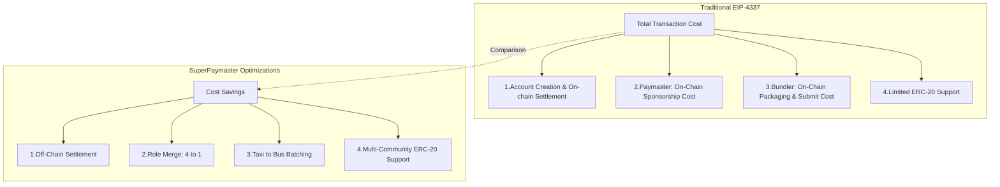
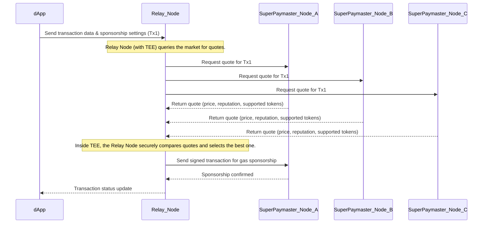
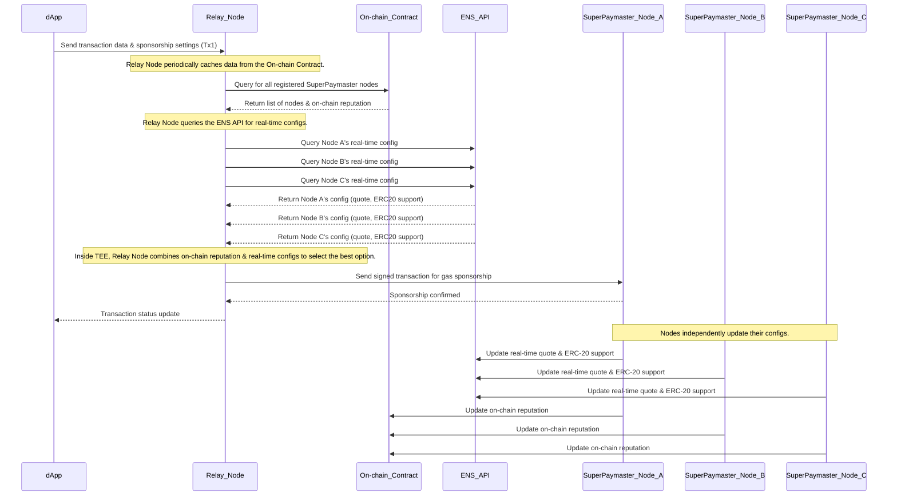
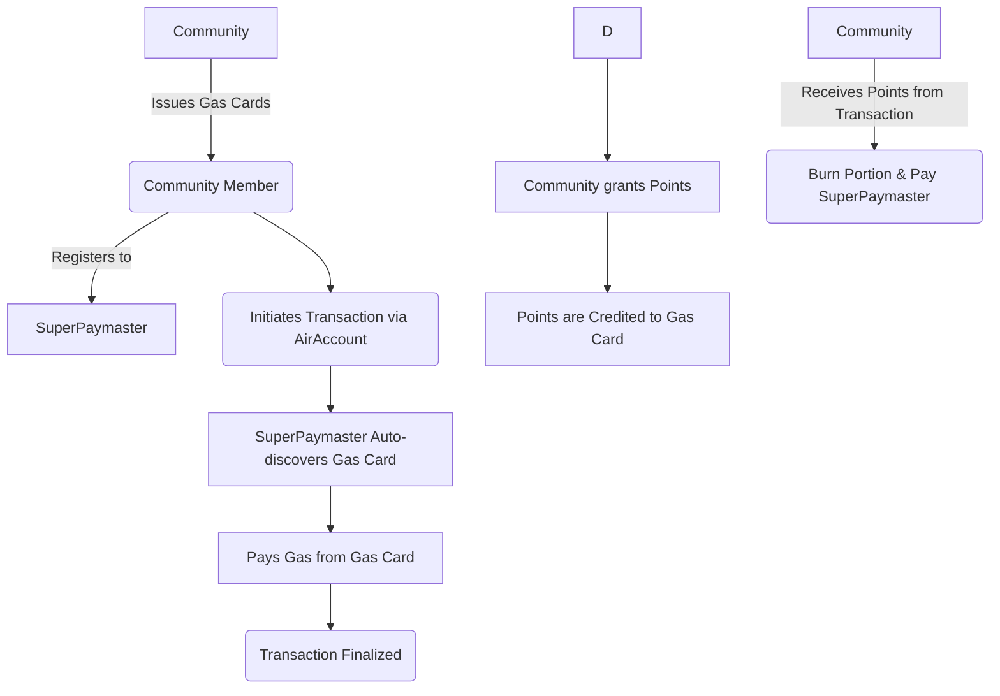

```mermaid
flowchart TD
    direction TB
    subgraph "Traditional EIP-4337"
        A[Total Transaction Cost] --> B[1.Account Creation & On-chain Settlement]
        A --> C[2.Paymaster: On-Chain Sponsorship Cost]
        A --> D[3.Bundler: On-Chain Packaging & Submit Cost]
        A --> E[4.Limited ERC-20 Support]
    end
    subgraph "SuperPaymaster Optimizations"
        direction TB
        F[Cost Savings] --> G[1.Off-Chain Settlement]
        F --> H[2.Role Merge: 4 to 1]
        F --> I[3.Taxi to Bus Batching]
        F --> J[4.Multi-Community ERC-20 Support]
    end
    A -.->|Comparison| F
```

```mermaid
sequenceDiagram
    participant dApp
    participant Relay_Node
    participant SuperPaymaster_Node_A
    participant SuperPaymaster_Node_B
    participant SuperPaymaster_Node_C

    dApp->>Relay_Node: Send transaction data & sponsorship settings (Tx1)
    
    Note over Relay_Node: Relay Node (with TEE) queries the market for quotes.
    Relay_Node->>SuperPaymaster_Node_A: Request quote for Tx1
    Relay_Node->>SuperPaymaster_Node_B: Request quote for Tx1
    Relay_Node->>SuperPaymaster_Node_C: Request quote for Tx1
    
    SuperPaymaster_Node_A-->>Relay_Node: Return quote (price, reputation, supported tokens)
    SuperPaymaster_Node_B-->>Relay_Node: Return quote (price, reputation, supported tokens)
    SuperPaymaster_Node_C-->>Relay_Node: Return quote (price, reputation, supported tokens)
    
    Note over Relay_Node: Inside TEE, the Relay Node securely compares quotes and selects the best one.
    Relay_Node->>SuperPaymaster_Node_A: Send signed transaction for gas sponsorship
    
    SuperPaymaster_Node_A-->>Relay_Node: Sponsorship confirmed
    Relay_Node-->>dApp: Transaction status update
```

```mermaid
sequenceDiagram
    participant dApp
    participant Relay_Node
    participant On-chain_Contract
    participant ENS_API
    participant SuperPaymaster_Node_A
    participant SuperPaymaster_Node_B
    participant SuperPaymaster_Node_C

    dApp->>Relay_Node: Send transaction data & sponsorship settings (Tx1)
    
    Note over Relay_Node: Relay Node periodically caches data from the On-chain Contract.
    Relay_Node->>On-chain_Contract: Query for all registered SuperPaymaster nodes
    On-chain_Contract-->>Relay_Node: Return list of nodes & on-chain reputation
    
    Note over Relay_Node: Relay Node queries the ENS API for real-time configs.
    Relay_Node->>ENS_API: Query Node A's real-time config
    Relay_Node->>ENS_API: Query Node B's real-time config
    Relay_Node->>ENS_API: Query Node C's real-time config
    
    ENS_API-->>Relay_Node: Return Node A's config (quote, ERC20 support)
    ENS_API-->>Relay_Node: Return Node B's config (quote, ERC20 support)
    ENS_API-->>Relay_Node: Return Node C's config (quote, ERC20 support)
    
    Note over Relay_Node: Inside TEE, Relay Node combines on-chain reputation & real-time configs to select the best option.
    Relay_Node->>SuperPaymaster_Node_A: Send signed transaction for gas sponsorship
    
    SuperPaymaster_Node_A-->>Relay_Node: Sponsorship confirmed
    Relay_Node-->>dApp: Transaction status update
    
    Note over SuperPaymaster_Node_A, SuperPaymaster_Node_C: Nodes independently update their configs.
    SuperPaymaster_Node_A->>ENS_API: Update real-time quote & ERC-20 support
    SuperPaymaster_Node_B->>ENS_API: Update real-time quote & ERC-20 support
    SuperPaymaster_Node_C->>ENS_API: Update real-time quote & ERC-20 support
    
    SuperPaymaster_Node_A->>On-chain_Contract: Update on-chain reputation
    SuperPaymaster_Node_B->>On-chain_Contract: Update on-chain reputation
    SuperPaymaster_Node_C->>On-chain_Contract: Update on-chain reputation
```

```mermaid
graph TD
    A[Community] -->|Issues Gas Cards| B(Community Member);
    B -->|Registers to| C[SuperPaymaster];
    D --> E[Community grants Points];
    E --> F[Points are Credited to Gas Card];
    B --> G(Initiates Transaction via AirAccount);
    G --> H[SuperPaymaster Auto-discovers Gas Card];
    H --> I[Pays Gas from Gas Card];
    I --> J(Transaction Finalized);
    K[Community] -->|Receives Points from Transaction| L(Burn Portion & Pay SuperPaymaster);
```